+ [Background](#background)
  * [datasets](#datasets)
  * [Evaluation Metrics](#evaluation-metrics)
+ [3D shape classification](#3d-shape-classification)
  * [基于多视图的方法](#基于多视图的方法)
  * [基于体积的方法](#基于体积的方法)
  * [基于点云的方法](#基于点云的方法)
    - [Pointwise MLP Methods](#pointwise-mlp-methods)
    - [Convolution-based Methods](#convolution-based-methods)
      + [连续卷积](#连续卷积)
      + [离散卷积](#离散卷积)
    - [Graph-based Methods](#graph-based-methods)
      + [Graph-based Methods in Spatial Domain](#graph-based-methods-in-spatial-domain)
      + [Graph-based Methods in Spectral Domain](#graph-based-methods-in-spectral-domain)
    - [Hierarchical Data Structure-basd Methods](#hierarchical-data-structure-basd-methods)
    - [Other Methods](#other-methods)
  * [Summary](#summary)
+ [3D Object Detection And Tracking](#3d-object-detection-and-tracking)
  * [3D Object Detection](#3d-object-detection)
    - [Region proposal-based Methods](#region-proposal-based-methods)
      + [基于多视图的方法](#基于多视图的方法-1)
      + [基于分割的方法](#基于分割的方法)
      + [Frustum-based方法](#frustum-based方法)
      + [其他方法](#其他方法)
    - [Single Shot Methods](#single-shot-methods)

# Background
## datasets

## Evaluation Metrics
- 3D shape classification
  * Overall Accuracy(OA):所有instance的平均精度
  * mean class accuracy(mAcc):所有shape classes的平均精度
- 3D object detection
  * Average Precision(AP)
- 3D single object tracker
  * Precision
  * Success
- 3D multi object tracking
  * Average Multi-Object Tracking Accuracy(AMOTA)
  * Average Multi-Object Tracking Precision(AMOTP)
- 3D point cloud segmentation
  * OA
  * mean Intersection voer Union(mIou)
  * mean class Accuracy(mAcc)
  * mAP

# 3D shape classification
- 该任务的方法通常是:
  1. 学习每个point的embedding，
  2. 然后使用聚合方法从整个点云中提取全局shape embedding
  3. 最后将全局shape embedding送入几个fc层得到分类结果
- 根据神经网络输入的数据类型，现有的三维形状分类方法可分为:
  1. 基于多视图：
    a. 将非结构化点云映射到2D图片
    b. 然后通过2D卷积网络实现形状分类
  2. 基于体积：
    a. 将点云转换为3D体积表示
    b. 然后通过3D卷积网络实现形状分类
  3. 基于点云的方法：
    a. 直接处理原始点云数据

  **基于点云的方法直接处理点云数据而不引入显式信息损失，从而变得更常用**。

  详细方法如下图所示
  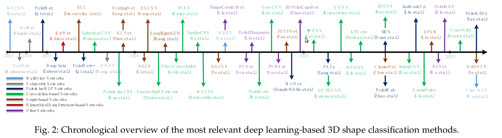

## 基于多视图的方法
- 这些方法首先将三维形状投影到多个视图中，提取视图特征，
- 然后融合这些特征以实现精确的形状分类
- 因此**如何将多个视图特征聚合成一个有区别的全局表示**是这些方法面临的一个关键挑战

- 一些代表方法
  * MVCNN
  * MHBN
  * View-GCN
  * ...
## 基于体积的方法
- 这些方法通常将点云体素化为三维网格，
- 然后将三维卷积神经网络（CNN）应用于形状分类的体积表示
- 一些代表方法
  * VoxNet
  * ...
- 虽然这些方法已经取得了令人鼓舞的性能，但这些方法无法很好地扩展到密集的三维数据，因为**计算和内存占用随着分辨率的增加呈立方体增长**。
- 为了降低计算和内存成本，引入了层次结构和紧凑结构(eg. OctNet)
- 一些代表方法
  * OctNet
  * PointGrid
  * 3DmFV

## 基于点云的方法
point-based方法根据网络架构可以分为：
1. pointwise MPL
2. convolution-based
3. graph-based
4. hierarchical data structure-based
5. others

### Pointwise MLP Methods
- 这些方法使用多个共享多层感知器（MLP）对每个点进行独立建模，
- 然后使用对称聚合函数聚合全局特征
- 如下图所示
  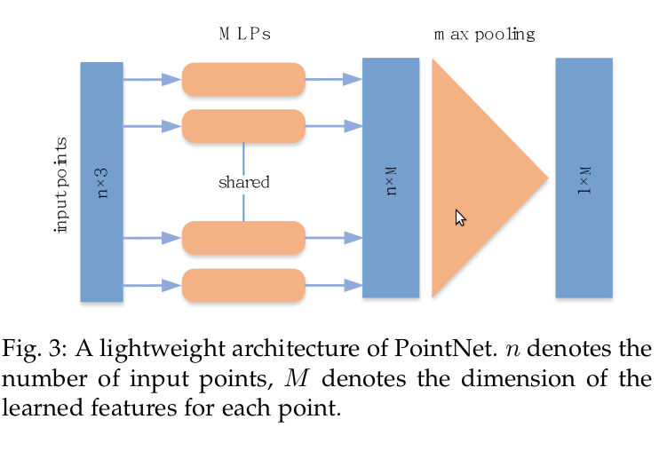
- 代表方法：
  * PointNet
  * PointNet++
  * PointNet-based
    + Mo-Net
    + Point Attention Transformers(PATs)
    + Group Shuffle Attention(GSA)
  * PointNet++-based
    + PointWeb(using Adaptive Feature Adjustment(AFA))
    + Structural Relational Network(SRN)
    + SRINet
    + PointASNL

### Convolution-based Methods
- 与2D网格结构上定义的核相比，三维点云的卷积核由于点云的不规则性而难以设计。
- 根据卷积核的类型，当前的3D卷积方法可分为:
  * 连续卷积方法
  * 离散卷积方法

    如下图所示
    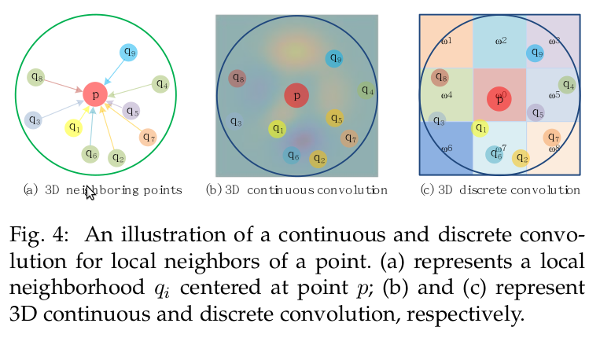
#### 连续卷积
- 在**连续空间**定义卷积核,
- 其中相邻点的权重与**相对于中心点的空间分布**相关
- 代表方法
  * 3D卷积可以解释为给定子集上的加权和
    + RS-CNN
    + DensePoint
    + ConvPoint
  * 使用现有的方法定义conv
    + PointConv
      + 为了提高内存和计算效率，三维卷积进一步简化为两种运算：**矩阵乘法和二维卷积**。
    + MCCNN
    + SpiderCNN
    + PCNN
  * 几种方法来解决三维卷积网络面临的旋转等变问题
    + 3D Spherical CNN
    + SPHNet(Based on PCNN)
    + Flex-Convolution

#### 离散卷积
- 这些方法在**规则网格**上定义卷积核，
- 其中相邻点的权重与**相对于中心点的偏移**有关
- 代表方法
  * GeoConv
  * PointCNN
  * RIConv
  * A-CNN
  * Rectified Local Phase Volume(ReLPV)
  * SFCNN

### Graph-based Methods
- 基于图的网络将点云中的每个点视为图的顶点，
- 并基于每个点的邻域生成图的有向边, 
- 然后在**空间域(spatial)** 或 **光谱域(spectral)** 中执行特征学习。
- 如下图所示
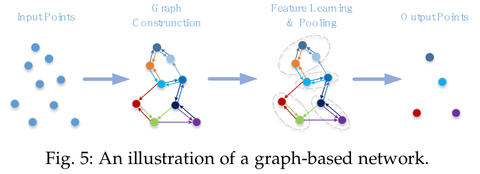

#### Graph-based Methods in Spatial Domain
- 这些方法是在空间域定义操作(eg. 卷积和池化)
- 代表方法
  * EdgeConditioned Convolution(ECC)
  * DGCNN
  * LDGCNN
  * FoldingNet
  * Dynamic Points Agglomeration Module(DPAM)
  * KCNet
  * G3D
  * ClusterNet
  * Grid-GCN

#### Graph-based Methods in Spectral Domain
- 这些方法将卷积定义为频谱滤波，
- 通过图上的信号与图的拉普拉斯矩阵的特征向量相乘实现
- 代表方法
  * RGCNN
  * AGCN
  * HGNN
- 以上说的方法都是在全局图上操作，还有一些探索局部结构化信息的方法
  * LocalSpecGCN
  * PointGCN
  * 3DTI-Net

### Hierarchical Data Structure-basd Methods
- 这些网络是基于不同的层次数据结构（如octree和kd-tree）构建的。
- 在这些方法中，point特征是沿着树从叶节点到根节点分层学习的。
- 代表方法
  * OctNet
  * Kd-Net
  * 3DContextNet
  * SO-Net
    + 与PointNet++相比，有层次的SOM更有效率并且充分探索了点云的空间分布。

### Other Methods
- RBFNet, 使用稀疏分布的Radial Basis Function(RBF)融合特征。
- 3DPointCapsNet
- PointDAN
- PointAugment
- ShapeContextNet
- RCNet, 使用RNN与2D CNN
  * RCNet-E
- Point2Sequences, RNN-based方法
- PVNet, 学习3D点云和2D图片
  * PVRNet

## Summary
- ModelNet10/40数据集是3D形状分类最常用的数据集
- 下表显示了一些point-based的网络结果对比
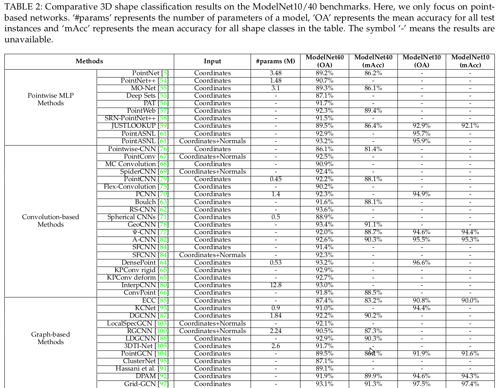
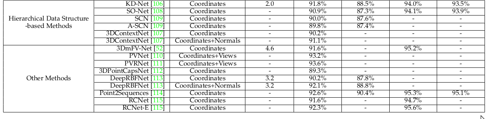
- 一些发现
  * 为了学习pointwise 特征，Pointwise MLP通常其他网络结构的基础block。
  * 基于卷积的网络可以在不规则3D点云上实现优异的性能。对于不规则数据，离散卷积网络和连续卷积网络都应受到重视。
  * 基于图的网络由于其固有的处理不规则数据的强大能力，近年来越来越受到人们的关注。然而，将spectral domain中基于图的网络扩展到各种图结构仍然具有挑战性。

# 3D Object Detection And Tracking
## 3D Object Detection
- 典型的3D对象检测器将场景的点云作为其输入，并围绕每个检测到的对象生成定向3D边界框，如下图所示。
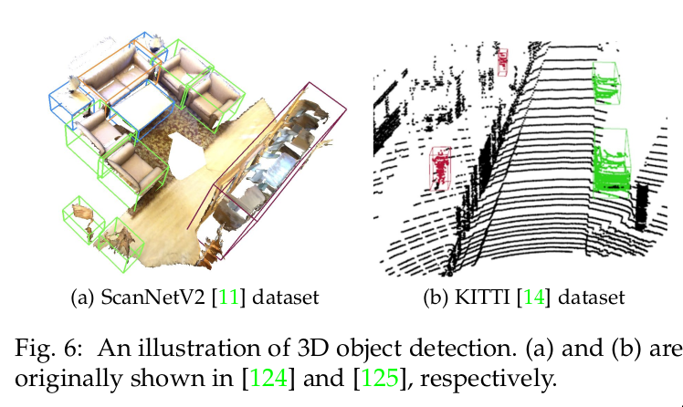
- 与图像中的目标检测类似，3D目标检测方法可分为两类：
  * region proposal-based方法
  * single shot方法
- 一些里程碑方法如下图所示
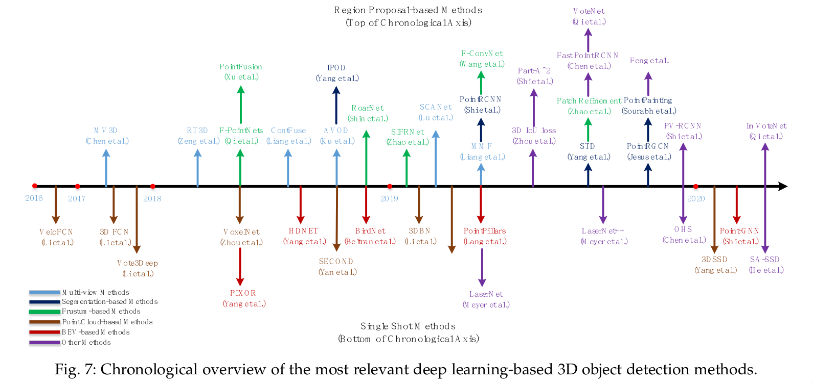

### Region proposal-based Methods
- 这些方法首先提出几个可能包含目标的区域(proposals),
- 然后提取区域特征以确定每个proposal的类别标签。
- 根据目标proposals生成方法，可以分为三类：
  * 基于多视图的方法
  * 基于分割的方法
  * frustum-based的方法
#### 基于多视图的方法
- 这些方法然融合来自不同视图maps(eg. 激光雷达前视图、鸟瞰视图（BEV）和2D图像)的区域建议特征。
- 来获得3D旋转边框，如下图所示
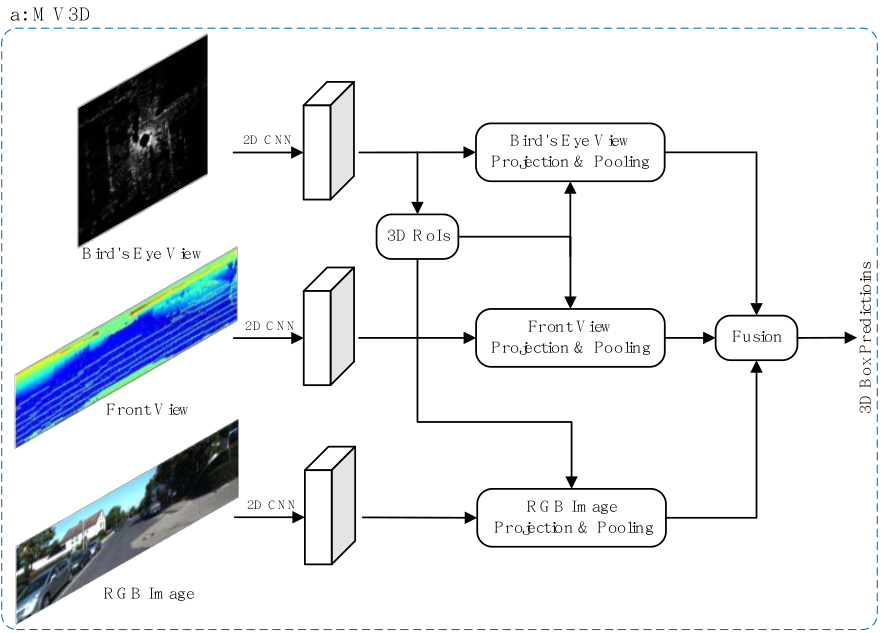
- 但这些方法的计算成本通常很高。
- MV3D
  * 尽管该方法实现了较好的效果，但是速度很慢;
  * 从两个方面可以改进
    + 一些方法提出更有效率的方式融合来自不同方面的信息:
      + AVOD为了提高小目标的recall，提出多模式融合建议区域
      + [Deep continuous..](https://paperswithcode.com/paper/deep-continuous-fusion-for-multi-sensor-3d-1)使用连续卷积在不同的分辨率有效的融合2D图像与3D LiDAR特征图
      + [Multi-task..](https://paperswithcode.com/paper/multi-task-multi-sensor-fusion-for-3d-object-1) 提出Multi-task multi-sensor 3D目标检测框架实现端到端训练
    + 一些方法研究从输入数据中提取更健壮的特征表示:
      + SCANet
        + Spatial Channel Attention(SCA)模块,提取全局和多尺度上下文信息来凸显有用的特征
        + Extension Spatial Unsample(ESU)模块,通过融合多尺度的低层特征获取有更丰富空间信息的高层信息。
        + 尽管取得的效果较好，但是由于需要对每个proposal进行特征pooling，所以上述的多视图方法速度很慢。
      + RT3D 
        + 使用pre-ROI pooling卷积来提高效率, 移除了ROI pooling之前的大部分卷积操作，所以ROI卷积操作可以一次性处理所有的目标proposals。

#### 基于分割的方法
- 这些方法首先利用现有的语义分割技术去除背景points，
- 然后在前景points上生成大量的高质量proposals
- 如下图所示
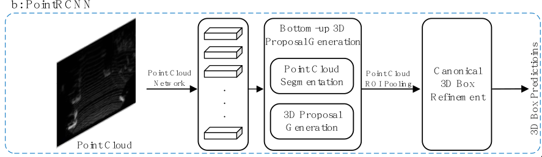
- 与基于多视图的方法相比，这些方法能够实现更高的recall，并且更适合包含高度遮挡和拥挤目标的复杂场景。
- 代表方法
  * IPOD
    + 使用2D分割网络去除背景
    + 提出新的标准`PointsIoU`减少冗余和模棱两可的proposals
  * PointRCNN
    + 直接分割3D点云来获取前景points然后融合语义特征和局部空间特征来产生高质量3D边框。
  * PointRGCN
    + 使用PointRCNN中的`RPN`部分
    + 使用GCN
    + 引入两个模块
      + R-GCN利用一个proposal中的所有points实现pre-proposal特征融合
      + C-GCN融合来自所有proposals的preframe信息，利用上下文回归精准的目标框
  * PointPainting
    + 将点云投影到基于2D图像的分割网络的输出中，
    + 并将语义预测分数附加到points上,
    + 再将painted points送入现有的检测器，以实现显著的性能改进
  * STD
    + 将每个point与球形anchor关联
    + 然后使用每个point的语义得分删除冗余anchor
    + 提出了PointsPool层来学习proposals内部point的紧凑特征
    + 引入了并行IOU分支来提高定位精度和检测性能
    + 该方法以更低的计算花费实现了比之前方法更高的recall

#### Frustum-based方法
- 这些方法首先利用现有的2D目标检测器来生成目标的2D候选区域，
- 然后为2D候选区域提取一个3D的frustum proposal。
- 如下图所示
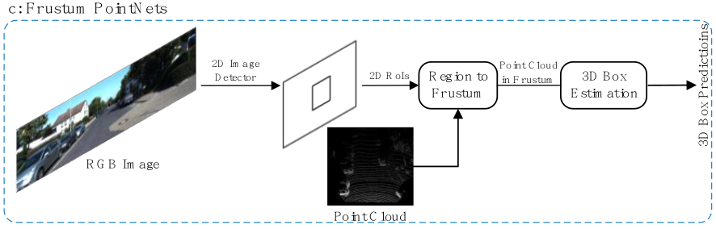
- 尽管这些方法可以额有效的提取3D目标可能的定位
- 但是该方法很依赖于(受限于)2D的目标检测器的性能
- 代表方法
  * F-PointNets
    + 该类方法的先驱
    + 为2D建议区域生成frustum proposal
    + 采用PointNet(或者PointNet++)为每个3D frustum学习点云特征来估计3D边框
  * Point-SENet
    + 使用注意力机制
    + 使用PointSIFT提取点云的旋转信息
  * PointFusion
    + 利用2D图像区域和相应的frustum points来回归3D边框
    + 提出了一个全局融合网络来直接回归边框的角点位置
    + 提出dense融合网络来预测每个角点的point-wise偏移量
  * RoarNet
    + 首先从2D图片估计目标的2D边框和3D姿态,
    + 然后再提取多个几何上可行的候选框
    + 3D候选框再通过边框回归网络来预测准确的3D目标框
  * Frustun convNet
    + 为每个2D区域沿着frustum axis生成frustums的序列，
    + 然后采用PointNet来提取每个frustum的特征，
    + 对frustum-level特征进行改造，生成二维特征图，然后将其送入全卷积网络进行3D边框估计
    + 该方法在基于2D的方法中实现了SOTA，并在KITTI官方排行中第一
  * Path refinement - localized 3D object detection
    + 首先在BEV map上获取一个初步的检测结果,
    + 然后在BEV的预测上提取小的point子集(patches)
    + 再采用一个refinement网络来学习patches的局部特征来预测精确地3D边框

#### 其他方法
- 受轴对齐IoU在图像目标检测中的成功推动, `iou loss for 2D/3D object detection`将两个3D旋转边界框的IoU集成到多个最先进的检测器，以实现一致的性能改进
- Fast point r-cnn
  * 提出一个two-stage网络架构来使用点云和3维像素表示
  * 首先，对点云进行voxelized，并将其送入3D主干网络，以产生初始检测结果,
  * 然后进一步利用初始预测的interior point特征进行边框优化
  * 尽管该方法简单，但是以16.7的FPS实现了与PointRCNN相当的结果
- PointVoxel-RCNN(PV-RCNN)
  * 利用3D卷积网络和PointNet-based set abstraction来学习点云特征
  * 输入点云首先voxelized，然后送入一个3D稀疏卷积网络来生成高质量的proposals
  * 学习到的voxel-wise特征经过一个voxel set abstraction模块编码为一组关键点
  * 也提出了一个keypoint-to-grid的ROI抽象模块来为边框优化捕捉丰富的上下文信息
  * 实验结果表明，该方法的性能明显优于以前的方法，在KITTI 3D检测基准的汽车类别中排名第一

- VoteNet 
  * 直接从点云中投票目标的虚拟中心点，并通过融合投票特征生成一组高质量的3D目标提案。
  * VoteNet只是用几何信息，明显的比之前的方法效果更好
  * 并在两个大型的outdoor基准(ScanNet,SUN RGB-D)上实现了SOTA
  * 然而，对于部分遮挡的目标，虚拟中心点的预测是不稳定的。
- [Relation graph network..](https://paperswithcode.com/paper/relation-graph-network-for-3d-object) 
  * 在VoteNet的基础上，未解决(缓解)部分遮挡而虚拟中心不稳定的问题
  * 添加了一个方向向量的辅助分支来提高虚拟中心和3D候选框的预测准确率
  * 还建立了一个proposals之间的3D object-object关系图来强调一些更有用处的特征来提高准确率

- ImVoteNet
  * 融合2D目标检测的信息(几何的和语义的信息)到一个3D投票pipeline

- Part-A2 Net
  * 受3D目标的GT提供了对象内部零件的精确位置这一观察的启发而提出
  * 由part-aware stage和part-aggregation stage组成
  * part-aware stage应用具有稀疏卷积和稀疏反卷积的类似于UNet的网络来学习用于预测和内部目标位置的粗糙生成的point-wise特征。
  * part-aggregation stage 采用ROI-aware pooling来为边框优化融合预测的部分定位

### Single Shot Methods
- 这些方法使用single-shot网络直接预测类别和回归3D bounding boxes,
- 不需要region proposals生成和后处理,
- 因此速度较快
- 根据输入数据的类型，single-shot方法可以分为3各类别：
  * BEV-baeds
  * discretization-based
  * point-based

#### BEV-baeds Methods
- 这些方法使用BEV表示作为输入
- 代表方法
  * PIXOR
    + 对等间距单元场景的点云进行离散化，
    + 再以类似的方式对反射率进行编码，从而得到规则的表示
    + 然后应用FCN估计目标的位置和航向角
    + 该方法由于大部分的single-shot方法(VeloFCN
    ,3D-FCN,Vote3Deep), 并以28.6fps运行
  * HDNET
    + 利用High-Definition(HD) maps的几何和语义的先验信息来提高鲁棒性和检测效果
    + 具体来说，该方法从HD map获得地面点的坐标，然后使用相对于地面的距离进行BEV表示，以弥补道路坡度造成的平移差异。
    + 此外，还将一个二值道路掩码与BEV表示在channel维度拼接来专注于移动物体
    + 由于HD maps并不是无处不在，还提出了一个在线map预测模块，用于估计单个激活雷达(LiDAR)点云估计map先验
    + 这个map-aware方法在TOR4D和KITTI数据集上指标明显高于他的baseline
    + 然而对不同密度的点云的泛化性能较差

  * BirdNet
    + 提出一个归一化map来考虑不同LiDAR传感器的区别
    + 归一化map是一个与BEV map具有相同分辨率的2D网络，它对每个单元格中包含的最大数目的points进行编码。结果表明，该归一化映射显著提高了基于BEV的检测器的泛化能力。

#### Discretization-based Methods
- 这些方法将点云转换为正则离散表示
- 然后使用CNN预测类别和3D边框
- 代表方法
  * [Vehicle detection ...](https://paperswithcode.com/paper/vehicle-detection-from-3d-lidar-using-fully) 
    + 首先提出了使用FCN来做3D目标检测
    + 将点云映射到2D的point map，然后使用2D的FCN来预测边框和置信度
    + 然后将点云离散化到4D(length,width,height,channels)的tensor,
    + 然后扩展2D的FCN-based方法到3D来做3D检测
  * [3D fully convolutional...](https://paperswithcode.com/paper/3d-fully-convolutional-network-for-vehicle) 
    + 相比于上一个方法，该方法准确率提高了20%
    + 但是由于3D卷积和数据的稀疏性，计算资源需求也相应增加
  * Vote3Deep
    + 为了解决3维像素(voxel)的稀疏问题
    + 利用一个以特征为中心的投票体系来为非空的3维像素生成一组投票,
    + 通过计算投票结果获得卷积结果。
    + 计算量是与占用的3维像素量成比例
  * 3D backbone network for 3D object detection
    + 通过堆叠多个稀疏3D CNN构建的一个3D backbone网络
    + 该方法充分利用voxel的稀疏性，节省内存，加快计算速度。
    + 该3D主干网络提取丰富的3D特征用于目标检测，而不会带来沉重的计算负担。

  * VoxelNet
    + voxel-based端到端训练的框架
    + 将点云划分为等间距的voxel，并将每个voxel内的特征编码为4D tensor
    + 然后通过一个region proposal网络来产生检测结果
    + 尽管他的表现很好，但是该方法由于voxels的稀疏性和3D卷积，速度很慢

  * SECOND
    + 使用稀疏卷积网络来提高`VoxelNet`推理的效率
    + 也提出了一个sine-error angle loss来解决角度0和π的相似

  * MVX-Net
    + 通过在较早的stage融合图片和点云特征扩展VoxelNet
    + 将VoxelNet生成的非空voxels与映射到image并使用预训练的网络来为每个voxel提取图像特征。
    + 再将这些图像特征与voxel特征连接起来，从而产生准确的3D边框
    + 与VoxelNet，SECOND相比，该方法可以有效的获取多模式的信息来减少false positive 和negatives。

  * PointPillars
    + 利用PointNet来学习以垂直列(柱)组织点云的特征,并将其编码作为pesudo image
    + 然后采用一个2D的目标检测pipeline来预测3D边框
    + PointPillars比大部分融合方法(包括MV3D,RoarNet,AVOD)精度(AP)高
    + 并且在3D和BEV KITTI基准上以62fps运行

  * SA-SSD
    + 受点云的部分空间信息不可避免地在现有单点检测器逐步缩小的特征图中丢失的观察启发
    + 利用细粒的结构信息来提高定位精度
    + 首先将点云转换为一个tensor，然后给backbone网络来提取multi-stage特征
    + 还提出一个point-level监督的辅助网络来引导特征学习点云的结构
    + 实验证明SA-SSD在KITTI BEV检测基准上汽车类别中排名第一(排行时间2020.6.12)

#### Point-based Methods
- 这些方法直接将原始点云数据作为输入
- 3DSSD是该类方法的先驱工作
  * 为Distance-FPS(D-FPS)和Feature-FPS(F-FPS)引入了一种融合采样策略, 以去除耗时的特征传播(FP)层和PointRCNN中的细化模块。
  * 然后使用一个Candidate Generation(CG)来充分利用代表性的points;
  * 再进一步送入一个有着3D centerness 标签的anchor-free回归头来预测3D目标框;
  * 实验证明3DSSD比two-stage point-based方法PointRCNN精度更高，且有着25fps;

#### Other Methods
- LaserNet
  * 预测每个point的边框概率分布然后融合这些point分布来生成最终的3D 目标框
  * 使用点云的dense Range View(RV)表示作为输入
  * 提出一个快速的mean-shift算法来减少每个point预测的噪声
  * 实现了0-50米的SOTA, 并且运行速度比现有的方法更快

- [Sensor fusion for...](https://paperswithcode.com/paper/sensor-fusion-for-joint-3d-object-detection)  
  * 在LaserNet基础上，使用RGB图像的纹理信息
  * 通过将三维点云投影到二维图像上，将激光雷达point与图像像素相关联，并利用这种关联将RGB信息融合到三维points中。
  * 也考虑3D语义分割作为一个辅助任务来学习更好的表示
  * 方法在保持LaserNet的高效率的同时，在远距离（eg. 50到70米）目标检测和语义分割方面都取得了显著的改进。

- [Object as hotspots..](https://paperswithcode.com/paper/object-as-hotspots-an-anchor-free-3d-object) 
  * 受孤立目标部分上的point可以提供有关目标位置和方向的丰富信息这一观察结果的启发
  * 提出了一个新的Hotspot表示,第一个hotspot-based anchor-free检测器
  * 原始点云数据首先voxelized然后作为backbone网络的输入来产生3D特征图
  * 这些特征图拿来分来hotspots和预测3D边框
  * 实验证明该模型表现良好，且在稀疏点云上有较好的鲁棒性

- Point-GNN
  * 使用GNN处理激光雷达(LiDAR)点云数据，检测3D目标
  * 首先将输入点云编码为具有固定半径的近邻图，
  * 然后将该图输入点GNN以预测对象的类别和方框。

### 3D Object Tracking
- 由于三维目标跟踪可以利用点云中丰富的几何信息，
- 因此有望克服基于图像的跟踪所面临的一些缺点，包括遮挡、照明和尺度变化
- [Leveraging shape ..](https://paperswithcode.com/paper/leveraging-shape-completion-for-3d-siamese) 
  * 受2D目标跟踪中Siamese network的启发,提出一种shape completion regularization的3D Siamese network
  * 首先使用卡尔曼滤波生成候选，然后使用形状正则化将模型和候选对象编码为紧凑表示
  * 再使用预先相似度来搜索下一帧的追踪目标
  * 该方法可以作为目标追踪的一个选项，比大部分2D目标追踪方法效果好(包括STAPLECA和SiamFC)

- [Efficient tracking..](https://arxiv.org/pdf/1903.10168.pdf) 
  * 利用一个2D Siamese网络在BEV表示上生成大量的粗糙的目标候选
  * 然后通过3D Siamese网络的余弦相似度优化校准候选
  * 该方法比上一方法精度高(18%)，成功率高(12%)

- Complexer-YOLO
  * 为语义点云 提出了3D目标检测和跟踪架构
  * 首先通过融合2D是觉得语义信息生成vixelized的语义点云
  * 然后利用时间信息来提高多目标跟踪的精度和鲁棒性
  * 此外，还引入了一个简单有效的评估指标(Scale-Rotation-Translation score (SRFs))来提高训练和推理速度
  * 在较好的跟踪效果的基础上，实现了实时跟踪

- Point-to-Box(P2B)
  * 将时间信息和搜索区域作为backbone的输入来获取seeds
  * 搜索区域seeds通过特定于目标的特征增强，然后通过Hough投票回归潜在目标中心。
  * 实验表明P2B效果好于第一种方法10%，并且以40fps运行

### 3D Scene Flow Estimation
- 给定两个点云X与Y, 3D场景流估计D = {di}N就是X中每个点xi与相应的Y中的每个点yi满足yi = xi + di
- 如下图所示，展现了两个KITTI点云的3D场景流估计
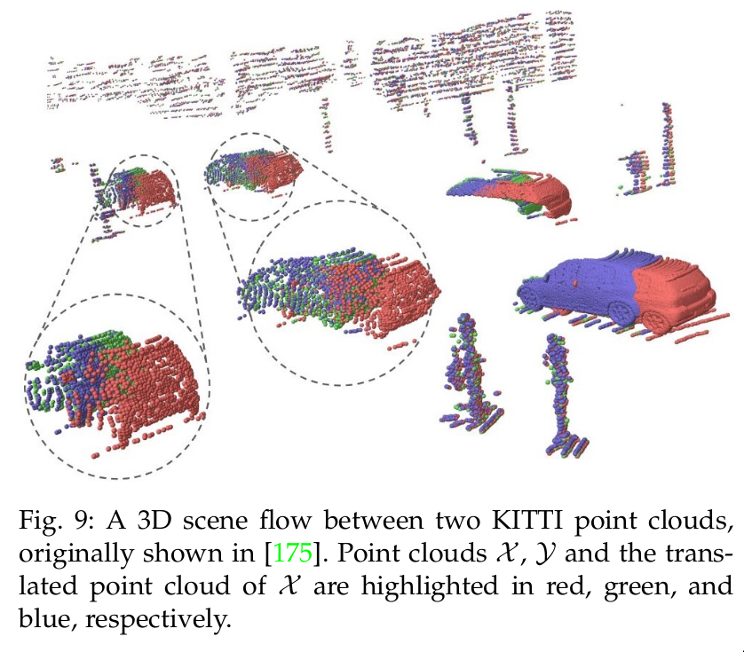 
- 与2D的光流估计相似，有几种方法已经开始从点云序列中学习有用的信息（如三维场景流、空间临时信息）
- FlowNet3D
  * 从一对连续的点云中直接生成场景流
  * 从flow embedding层学习point-level特征和动作特征
  * 有两个缺点
    + 一些预测动作向量在他们的方向上明显与GT不同
    + FlowNet很难应用于非静态场景，尤其是由可变形目标控制的场景。
    + 为了解决这些问题，提出了FlowNet3D++
- FlowNet3D++
  * 提出了余弦距离损失来最小化预测与GT的角度
  * 也提出了一个point-to-plane的距离损失来提高固定不变的和动态的场景
  * 实验表明这两个损失将FlowNet3D的精度从57.85%提高到63.43%
  * 并且提高了速度和训练的稳定性
- HPLFlowNet
  * 直接从大尺度点云中估计场景流
  * 提出了几个双向卷积层来还原原始点云中的结构信息，并且减少了计算量

- PointRNN, PointGRU, PointLSTM
  * 为了有效的处理点云序列而提出, 用来最终移动的points
  * 可以捕捉时序空间的的信息然后建模动态点云

- MeteorNet
  * 直接从动态点云中学习特征表示
  * 融合相邻points的时空信息
  * 进一步引入直接分组和chained-flow分组来确定时间邻域。
- [Just go with the flow](https://paperswithcode.com/paper/just-go-with-the-flow-self-supervised-scene)
  * 上述的模型的效果受限与数据集的大小
  * 提出了两个自监督损失再大型未标注数据集上训练网络
  * 核心概念是"健壮的场景流估计方法在前向和后向传播应该都是有效的"
  * 由于场景流注释的不可用性，预测变换点的最近邻被视为伪标签
  * 但是GT与伪GT可能存在不同，所以计算了反向的场景流，并提出了循环一致性损失来将点转换到原始位置
  * 实验表明该自监督方法超过了监督方法的SOTA

### Summary
- KITTI基准是自主驾驶领域最具影响力的数据集之一，在学术界和工业界都得到了广泛应用。
- 下面两个表显示了KITTI test 3D基准上不同检测器获得的结果
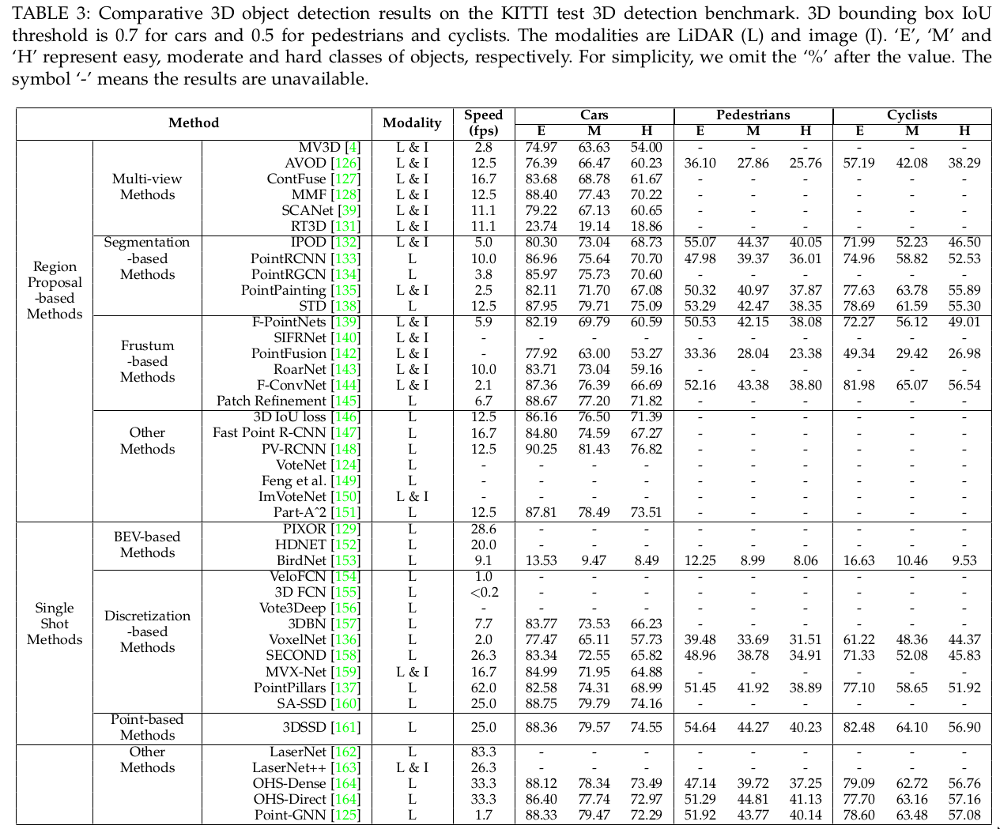 
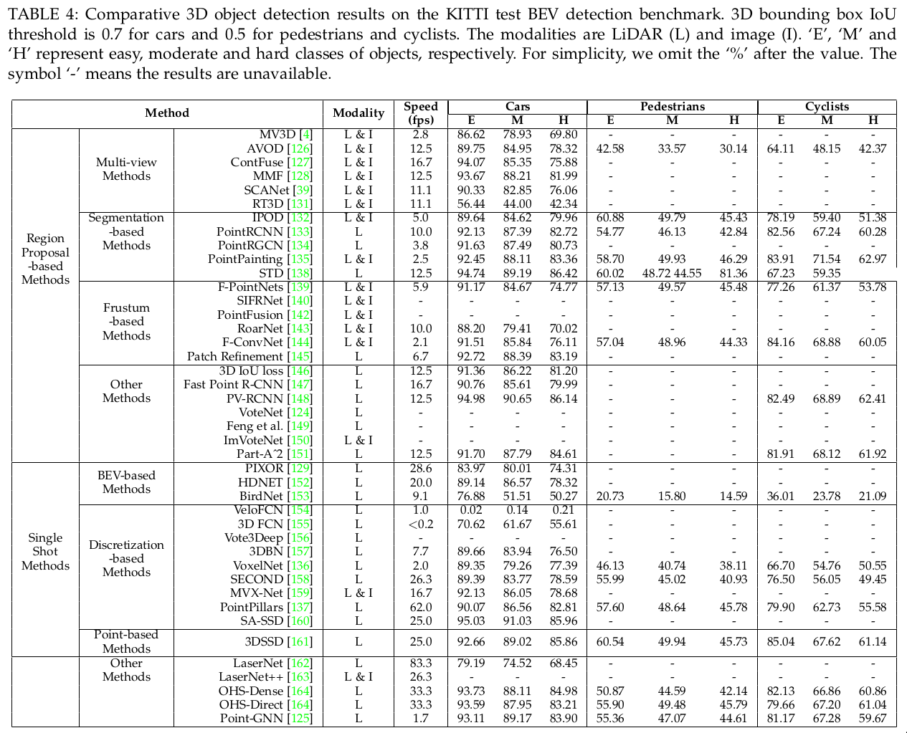 
- 一些发现
  * Region proposal-based方法是这两类方法中最常研究的方法，在KITTI test 3D和BEV基准上都比single-shot方法有很大的优势。
  * 先存的3D目标检测有两个局限:
    + long-range的检测能力在现有的方法中是欠缺的
    + 如何全面开发2D图片中的纹理信息还是个问题
  * 多任务学习是3D检测的未来方向，比如MMF通过融合多任务学习了一个跨模态表示来实现SOTA的检测效果
  * 3D目标跟踪和场景流估计是新兴的研究课题，自2019年以来逐渐引起人们的关注。

## 3D 点云分割
- 3D点云分割需要同时理解每个point的几何信息结构和细粒细节
- 根据分割粒度可以分为三类：
  * 语义分割(scene level)
  * 实例分割(object level)
  * part segmentation(part level)

### 3D 语义分割
- 给定一个点云，语义分割的目标是根据point的语义将其划分为若干个子集，与3D形状分类法类似
- 语义分割有四种范式：
  * 基于投影
  * 基于离散化
  * 基于点
  * 混合方法
- 投影和离散化方法的第一步是将点云转换为中间规则表示，例如多视图，球面，体积，permutohedral lattice，混合表示,
- 然后将中间分隔结果投影会原始点云。
- 如下图所示
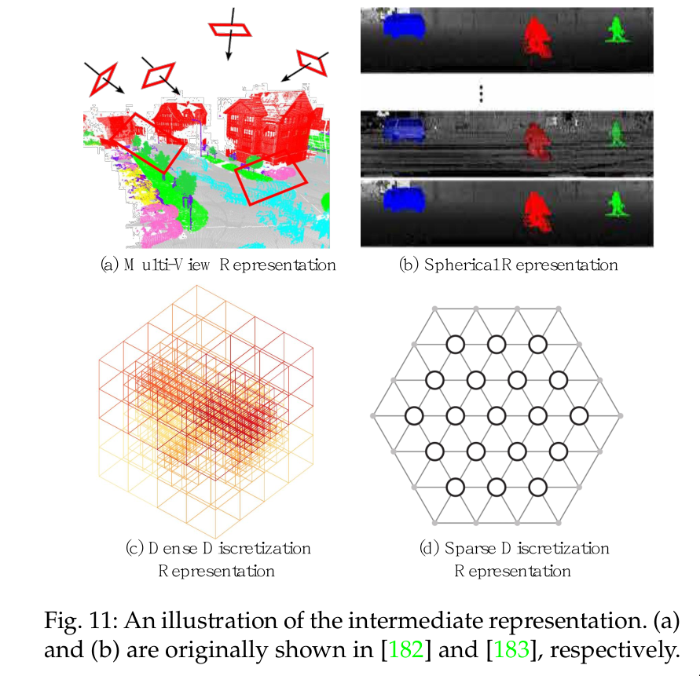 
- 相反，基于点的方法直接适用于不规则点云
- 几种代表方法如下图所示
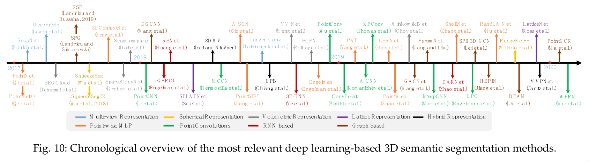 

#### 基于投影的方法
- 这些方法通常投影3D点云到2D图片，包括多视图和球形图片
##### 多视图表示
- [Deep projective 3D semantic segmentation](https://paperswithcode.com/paper/deep-projective-3d-semantic-segmentation)
  * 首先从多个虚拟摄像机视图将3D点云投影到2D平面
  * 然后，使用多流FCN预测合成图像上的像素级分数。
  * 通过融合不同视图上的重投影分数，得到每个点的最终语义标签。

- [Unstructured point cloud semantic...](https://paperswithcode.com/paper/unstructured-point-cloud-semantic) 
  * 首先使用多个摄像头位置生成点云的多个RGB和深度快照，然后使用2D分割网络对这些快照执行像素级标记
  * 这些RGB和深度图片的预测分数再通过残差连接进一步融合。

- [Tangent convolution](https://paperswithcode.com/paper/tangent-convolutions-for-dense-prediction-in) 
  * 基于从局部欧几里德曲面采样点云的假设，引入了切线卷积，用于密集点云分割。
  * 此方法首先将每个点周围的局部曲面几何体投影到虚拟切线平面。
  * 然后直接在曲面几何体上操作切线卷积。
  * 该方法具有很强的可扩展性，能够处理具有数百万个点的大规模点云。
- 整体来说，多视图分割方法对视点选择和遮挡非常敏感。
- 此外，由于投影步骤不可避免的引入信息丢失，这些方法没有充分利用潜在的几何和结构信息

##### 球面表示
- SqueezeSeg
  * 为了实现快速和准确的3D点云分割，
  * 基于SqueezeNet和Conditional Random Field(CRF)提出了端到端的网络结构。
- SqueezeSegv2
  * 利用无监督领域适配管道解决域偏移问题，提高精度
- RangeNet++
  * 对于激光雷达点云的实时语义分割
  * 首先将二维距离图像的语义标签转换为三维点云，
  * 然后采用一种基于GPU的KNN后处理方法来缓解离散化误差和模糊推理输出的问题。
  * 与单视图投影相比，球面投影保留了更多的信息，适合于激光雷达点云的标记。
- 然而这种中间表示不可避免地会带来一些问题，如离散化错误和遮挡。

#### 基于离散的方法
- 这类方法通常将点云转换为一个密集/稀疏的离散表示，比如说，体积和稀疏permutohedral lattices
##### 密集离散表示
- 早期的方法通常将点云voxelized为密集网格，然后利用标准的3D的卷积。
- Point cloud labeling using 3D convolutional neural nwtwork
  * 首先将点云划分为一组占用体素(voxel)，
  * 然后将这些中间数据提供给全3D 卷积进行体素分割。
  * 最后，为体素内的所有点指定与体素相同的语义标签。
  * 该方法的性能受到体素粒度和点云划分引起的边界伪影的严重限制。
- SEGCloud
  * 实现了细粒度和全局连续的语义分割
  * 引入了一个确定三线插值来将3D-FCNN生成的粗糙的体素预测映射回点云
  * 然后使用全连接CRF(FC-CRF)来对推理出来的逐点标签注入空间连续性

- VV-Net
  * 引入了一个基于核的插值变分自动编码器架构，用于对每个体素内的局部几何结构进行编码,
  * 与二进制占用表示不同，RBFs用于每个体素，以获得连续表示并捕获每个体素中的点分割，
  * VAE进一步用于将每个体素内的点分布映射到紧凑的潜在空间
  * 然后使用对称组和equivalence CNN实现健壮的特征学习
- 由于3D CNN良好的可扩展性，基于体积的网络结构可以使用不同的空间size来训练和测试点云
- Fully-Convolutional Point Network(FCPN)
  * 首先从点云中分层提取不同层次的几何关系，
  * 然后使用3D卷积和加权平均池来提取特征并合并长期依赖关系。
  * 该方法可以处理大规模的点云，并且在推理的时候有良好的扩展性

- ScanComplete
  * 实现3D扫描完成和逐体素语义标记。
  * 该方法利用全卷积神经网络的扩展性，并在训练和测试的时候采用不同的输入data sizes
  * 提出一种"由粗到细"的策略来分层提高预测结果的清晰度(or 分辨率)
- 整体来说，体积表示自然保留了3D点云的领域结构,
- 其常规数据格式还允许直接应用标准3D卷积,
- 这些因素导致该领域的稳步提高。
- 然而体素化步骤固有的引入了离散化伪影和信息丢失。
- 通常高分辨率会导致高内存和计算成本，而低分辨率会导致细节丢失

##### 稀疏离散表示

### 3D 实例分割

### 3D part分割
