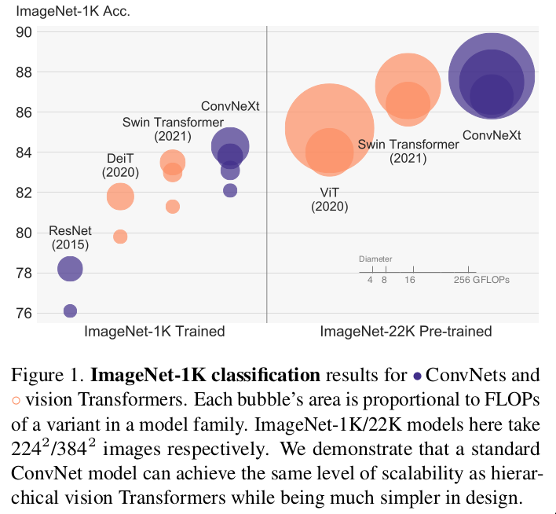
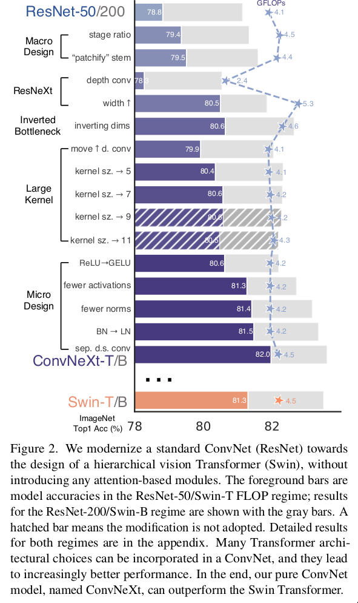
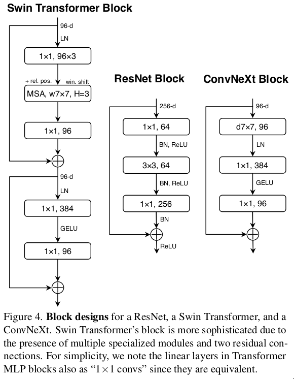

- **paper**: [https://arxiv.org/pdf/2201.03545v1.pdf](https://arxiv.org/pdf/2201.03545v1.pdf)
- **code**: [https://github.com/facebookresearch/ConvNeXt](https://github.com/facebookresearch/ConvNeXt)

## Summary

* 根据transformer的设计特点，基于ResNet进行改进
* 融合transformer的特点到ConvNet中，例如
  + `patchify` stem
  + 增大kernel size
  + RELU -> GELU
  + BN -> LN
  + 减少`activations`和`norms`
  + ...
* 在同等模型size以及FLOPs下，无论是网络的分类效果还是迁移到下游任务(检测和分割)的精度都超过了`swin transformer`

