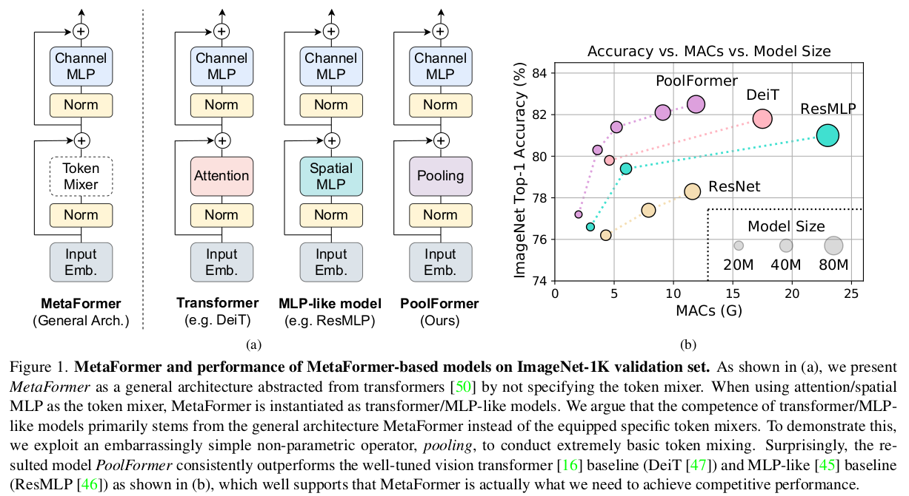
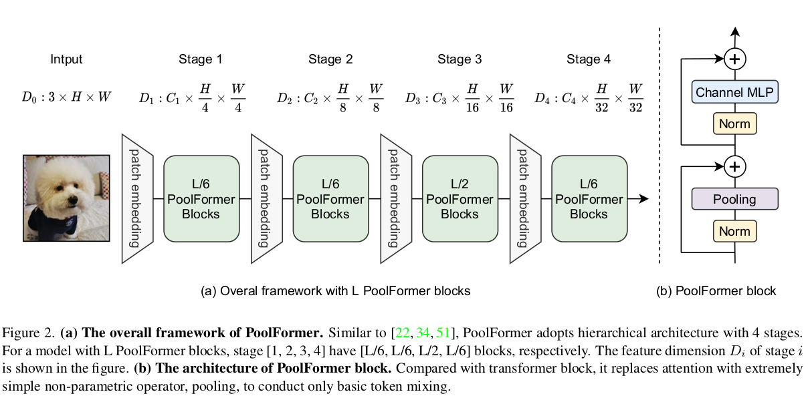
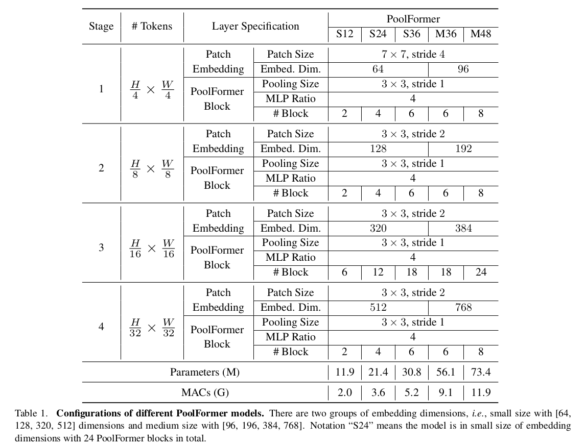
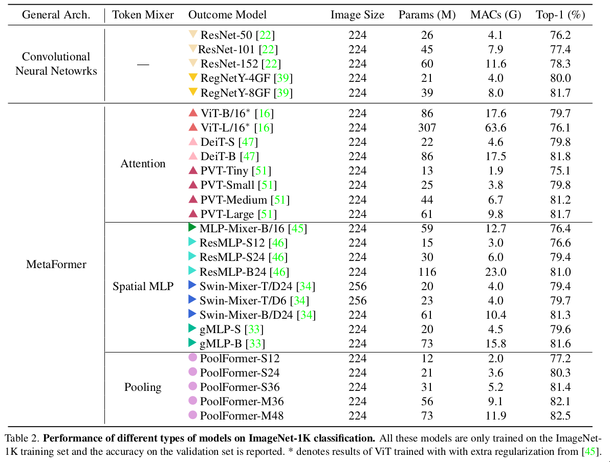
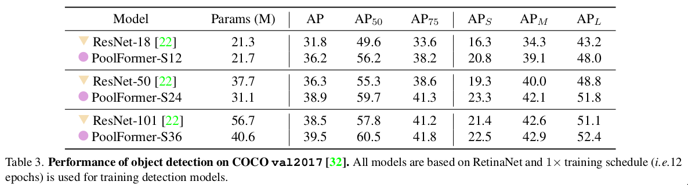
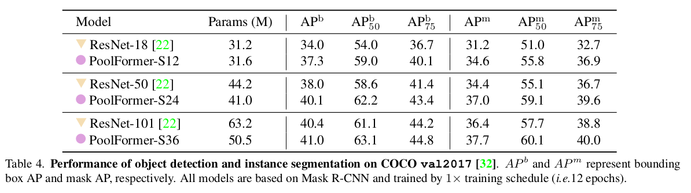
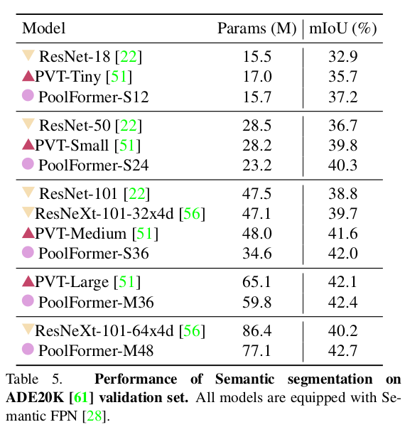

- **paper**: [https://arxiv.org/pdf/2111.11418v1.pdf](https://arxiv.org/pdf/2111.11418v1.pdf)
- **code**: [https://github.com/sail-sg/poolformer](https://github.com/sail-sg/poolformer)

- 图中具有`transformer`架构，将`Attention`模块采用一个可替换的`Token Mixer`代替，称之为`MetaFormer`
- 如图所示
  * **transformer = MetaFormer+Attention**
  * **MLP-like model = MetaFormer+Spatial MLP**
  * **PoolFormer = MetaFormer+Pooling**

## 贡献
- 认为transformer work的点在于其架构，而不是Attention
- 使用简单的无参数的Pooling代替Attention作为Token Mixer
- 在图像分类以及目标检测、分割等下游任务证明其有效性

## 网络整体结构

## Thinking
- 实验部分虽然先比下来，PoolFormer虽然有较好的精度与[params,MACs]的平衡, 但相比的结果精度都不算高
  * ImageNet-1K(~82%)

  * COCO(37%~40%)

  * ADE20k(~40%)

- 由上面实验结果可见，该方法对于小模型低精度，效果更好，但是未给出大模型高精度的对比;
- 估计PoolFormer的建模能力还是比不上Transformer, 建模能力还是Transformer比较强大
  * 消融实验中的`Hybrid Stages`部分，将后面两个stage替换为Attention(transformer),**78.3->81.0**, 也能够证明Attention的建模能力
- Transformer不仅能够处理分类，检测，分割，对于self-superived(MAE也是使用transformer才将MIM做出效果), 多模态等方面也有很好的处理效果
- 感觉transformer因为Attention而具有强大的建模能力，能够处理CV大部分任务(全部)，虽然PoolFormer简化了Transformer, 但是PoolFormer还不确定，大概率只能处理一部分简单任务且精度做不到很高；
