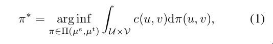
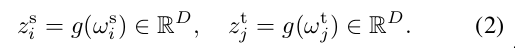
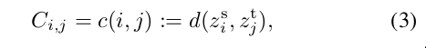
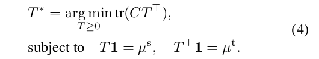
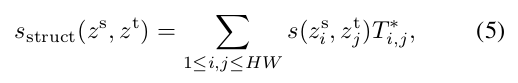
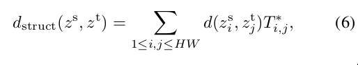
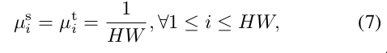
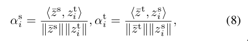
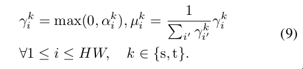

## 贡献
- 与现存的方法不同，现存的方法都是比较特征向量的距离
- 而该论文的方法还利用了图像空间上的信息来做比较
- 主要是提出了3个关键的组件：
  * Structural Similarity(SS)
  * Spatial Cross-Correlation(CC)
  * Multi-scale Matching(MM)

## Structural Similarity via Optimal Transport
- 基于最优运输来计算特征相似度
- 最优运输
  * 对于分别分布在概率空间U和V的源分布µs与目标分布µv, 最小化运输cost看作是最小化两个分布的`Wasserstein distance`。
  * `Wasserstein distance`如下所示:
  
  * 公式具体参数可看原论文
- 计算cost
  * ws和wt表示输出特征图
  * zs和zt表示映射的特征向量
  
  * `i`到`j`的运输cost为：
  
- 使用`Sinkhorn divergence algorithm`来优化最优运输问题

  * 其中T\*表示两个分布的最佳matching flow

## Deep Interpretable Metric Learning
### Structural Similarity(SS)
- 对于µs与µt(下面会提及)以及cost矩阵C，解决了eq4，得到了T\*之后，可以定义两个特征图之间的结构性相似度为:

- 同样的，两个特征图的距离也可以表示为:

### Cross-Correlation(CC)
- 上面公式中很重要的一部分是µs与µt的定义, 这两个值可以直接使用uniform分布初始化：

- 但是这样初始化相当于对比的两张图的各个部分权重一致，比如说一张图当中只有主要特征部分，而另一张图有大量背景信息，这样初始化权重则是一视同仁，找不到主要信息；
- 因此为了让对比的两张图**聚焦于主要信息**，使用如下公式获得特征权重：

  * 其中zs,zt为网络输出特征图，z-s,z-t为进行全局池化后的特征向量
- 最终获取µki的公式为：

### Multi-scale Matching(MM)
- 尽管DIML可以捕获两张图的结构相似度，但是需要更多的计算量(O(H2W2))去解决最佳运输问题;
- 为了解决这个问题，首先计算两个特征向量的余弦相似度(1x1 scale)，然后取最高的K个，再来计算结构相似度(H x W scale);
