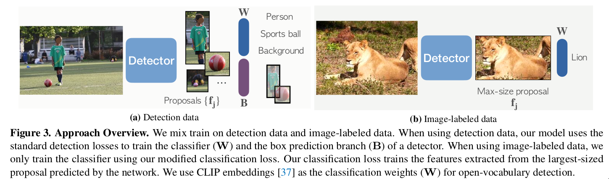

- **paper**: [https://arxiv.org/pdf/2201.02605v2.pdf](https://arxiv.org/pdf/2201.02605v2.pdf)
- **code**: [https://github.com/facebookresearch/Detic](https://github.com/facebookresearch/Detic)

## Summary

* 可训练只带分类标签(无bbox标签)的数据
* 基于two-stage检测器与CLIP一起使用
* 在检测器第二阶段针对最大size的proposal提取特征然后与CLIP提取的相应embeding做损失
