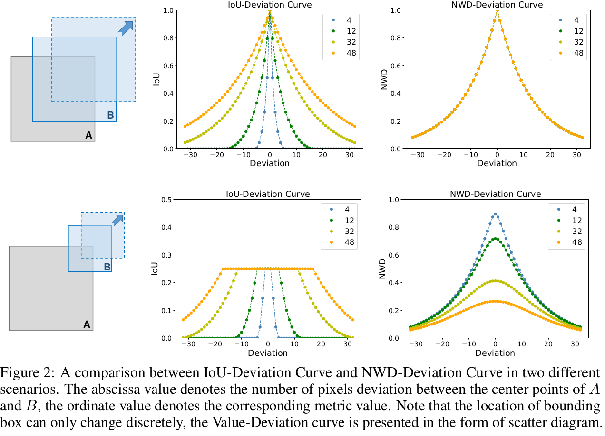

- **paper**: [https://arxiv.org/pdf/2110.13389v1.pdf](https://arxiv.org/pdf/2110.13389v1.pdf)
- **code**: not yet

## 贡献
- 提出基于Wasserstein Distance来度量bbox之间的距离, 提升小目标检测性能
- 提出小目标新数据集AI-TOD

## 动机

- 以IOU为基准，bbox同样的偏移对于小目标与大目标的影响是不一样的
  * 如上图所示，对于6x6的小目标，轻微的偏差会导致明显的IOU下降(0.53 → 0.06)
  * 而对于较大物体，同样的偏移量，IOU变化较小(0.9 → 0.65)
- 对于小目标检测(TOD)也有其他方式提高性能，比如GAN生成高质量的超分辨表示或者使用多尺度金字塔FPN, 但这些方法在提高性能的同时也带来了额外的计算量

## 相关工作
- 多尺度特征学习
  * SSD
  * FPN
  * .
  * .
  * .
- 设计更好的训练策略
  * SNIP
  * SNIPER
  * Scale-Aware Network(SAN)
- 基于GAN增强的检测
  * Perceptual GAN
  * MT-GAN
  * .

## 方法
- 将bbox坐标按照高斯分布建模，然后只用**Wasserstein Distance取代IOU作为度量标准**
- 可以将`Wasserstein Distance`添加到`label assgin`、`loss`、`nms`中
### Wasserstein Distance的优点
1. 无论小目标之间有没有重叠都可以度量分布的距离
2. NWD对于不同尺度的目标不敏感，更适合测量小目标之间的相似性

### 高斯建模
- **假定对于一个bbox(cx, cy, w, h)，中心位置更有可能包含目标前景像素值，而远离中心位置更有可能包含背景像素**；因此将bbox坐标按照高斯分布建模
- 首先按照椭圆公式建模, 如下：

  * 其中µx = cx, µy = cy, σx = w/2 , σy = h/2 .
- 上述椭圆公式将是2D高斯分布的密度轮廓
- 因此bbox(cx, cy, w, h)可以建模为N(µ, Σ)的2D高斯分布

### 计算Wasserstein Distance
- 对于高斯分布，WD的计算公式为：

- 由于WD是距离不是相似度，因此最终公式为：

### 实验结果

