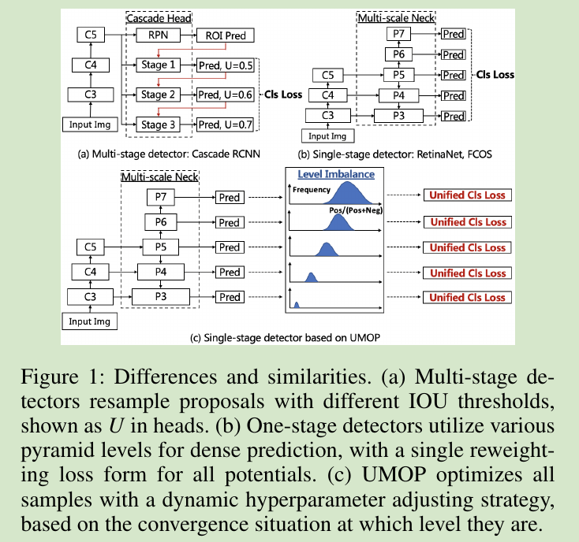
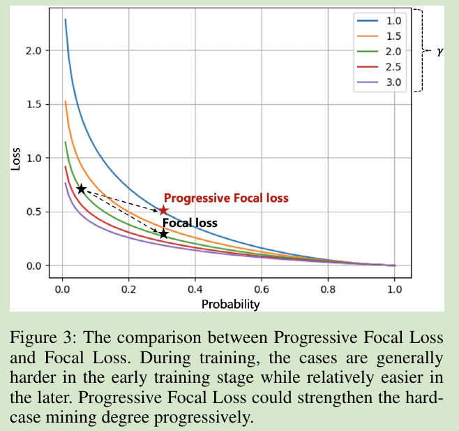
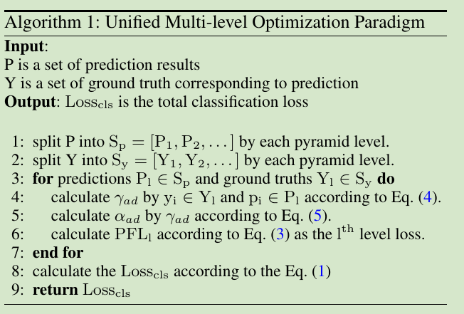
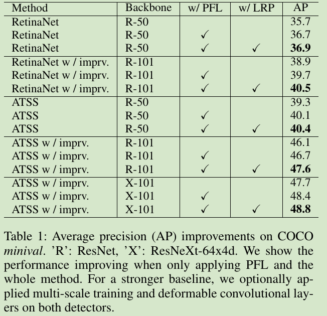
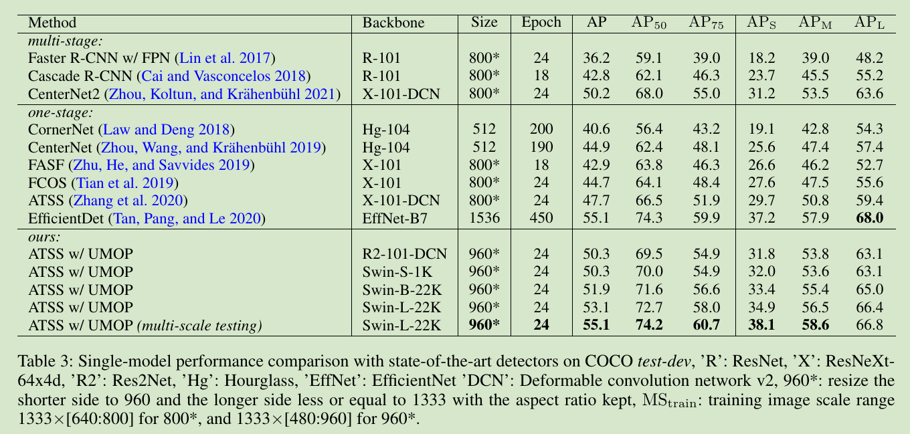
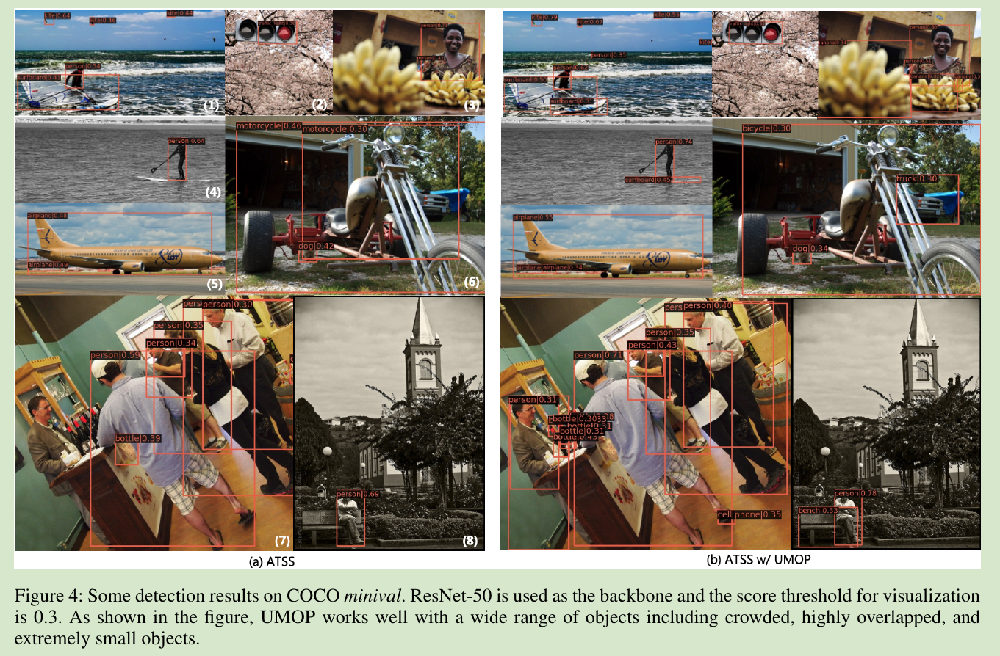

- [Contributions](#contributions)
- [The Statistical Analysis on Level Imbalance](#the-statistical-analysis-on-level-imbalance)
  + [实验设置](#实验设置)
  + [特征层级的不平衡统计](#特征层级的不平衡统计)
- [Unified Multi-level Optimization Paradigm](#unified-multi-level-optimization-paradigm)
  + [Level-wise Resampling Paradigm](#level-wise-resampling-paradigm)
  + [Progressive Focal Loss](#progressive-focal-loss)
- [Experiments](#experiments)
  + [General Promotion on Different Detectors](#general-promotion-on-different-detectors)
  + [Analysis on Convergence Speed](#analysis-on-convergence-speed)
  + [Comparison with State of the Art](#comparison-with-state-of-the-art)
  + [Visualization](#visualization)

**code**: [https://github.com/zimoqingfeng/UMOP](https://github.com/zimoqingfeng/UMOP) 

**paper**: [https://arxiv.org/pdf/2109.07217.pdf](https://arxiv.org/pdf/2109.07217.pdf) 

 

### Contributions
1. 通过实验证明FPN的性能在一定程度上受到**特征层级之间不平衡问题**的限制。
2. 提出的改进方法**UMOP缓解了特征层级之间的不平衡问题, 可以提高one-stage检测器大约1.5的mAP，且收敛更快**，没有额外计算量。
3. 论文的最佳模型在MS COCO测试设备上实现了55.1 AP，这是迄今为止单级探测器中的SOTA。

- UMOP
  -  独立的分类损失监控每个金字塔级别，并考虑单独的重新采样.
  -  渐进式硬案例挖掘损失(progressive hard-case mining loss)定义了金字塔级别的所有损失，解决了级别不平衡问题，无需额外的级别设置。

### The Statistical Analysis on Level Imbalance
#### 实验设置
两个anchor-based方法
- RetinaNet
- ATSS

两个anchor-free方法
- FCOS
- VFNet

使用MSCOCO数据集训练一个epoch，FPN作为neck，采用backbone中的C3～C5，并扩展到P3～P7, 如图1;
#### 特征层级的不平衡统计
 
对于没有特定情况的常规分析，在整个训练周期内对四种不同检测器进行了统计分析：在每次训练迭代期间，
记录了每个特征金字塔级别中正样本占总样本的比例，并在图2中总结为方框图。

如图2所示，**不同层级的标签分布不同，每个模型的P7在训练过程中更有可能获得正样本**；

结果清楚地揭示了multi-level检测器在任何情况下的特征层级之间不平衡现象。
因此，**作者认为固定超参数设置的Focal loss不能同时对所有金字塔级别进行良好的权衡**。

### Unified Multi-level Optimization Paradigm

#### Level-wise Resampling Paradigm
如图1(c)所示，分别计算每个特征层的分类损失，然后对损失相加并求和:
 
Pl是第l层的网络输出预测，Yl是分配给该层的标签，Lossl是l层的损失；

#### Progressive Focal Loss
原本的Focal loss:
 
论文对于Focal loss的形式没有改变，只是在α和γ的设置上有改变, α和γ在训练过程中是会改变的：
 
γad的设计考虑了正样本在各个金字塔层次上的预测质量:
 
 
当然γ有一个范围，γad ∈ [γ − δ, γ + δ] , δ是一个常数(实验时设置为0.5)； 
w也是一个常数(实验时设置为0.5)；

γad能够反映整个层级的收敛情况，γad在训练的初期会有一个较大的值，之后随着训练优化的进行，慢慢变小；
如图3所示:
 
这样一个动态调整schedule可以使模型在开始时强调hard sample，并在hard sample和easy sample没有足够区分时逐渐提高区分能力。

整个UMOP的流程如下图所示：
 

### Experiments
#### General Promotion on Different Detectors
 

#### Analysis on Convergence Speed
 

#### Comparison with State of the Art
 

#### Visualization
 

