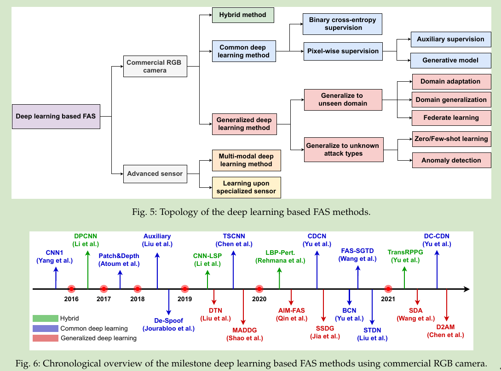
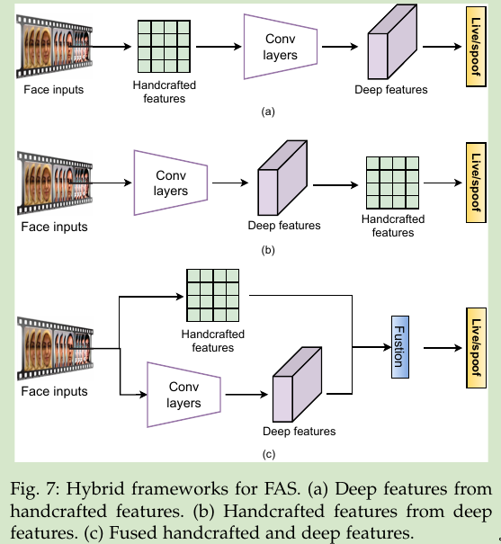
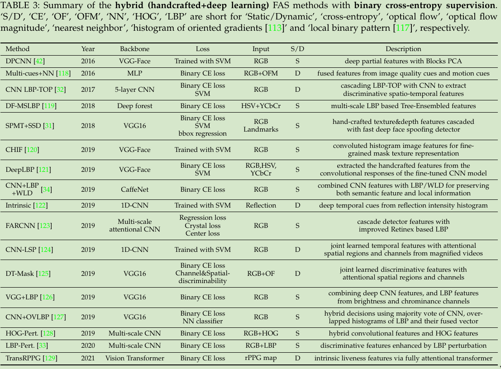
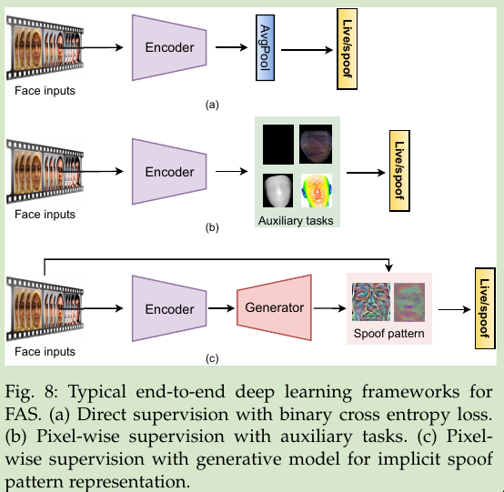
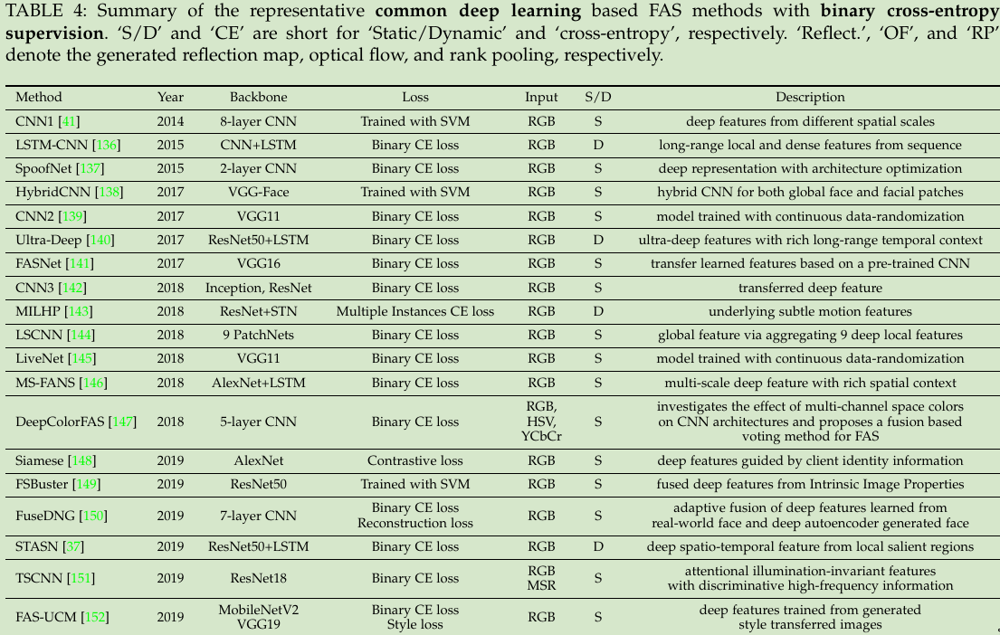
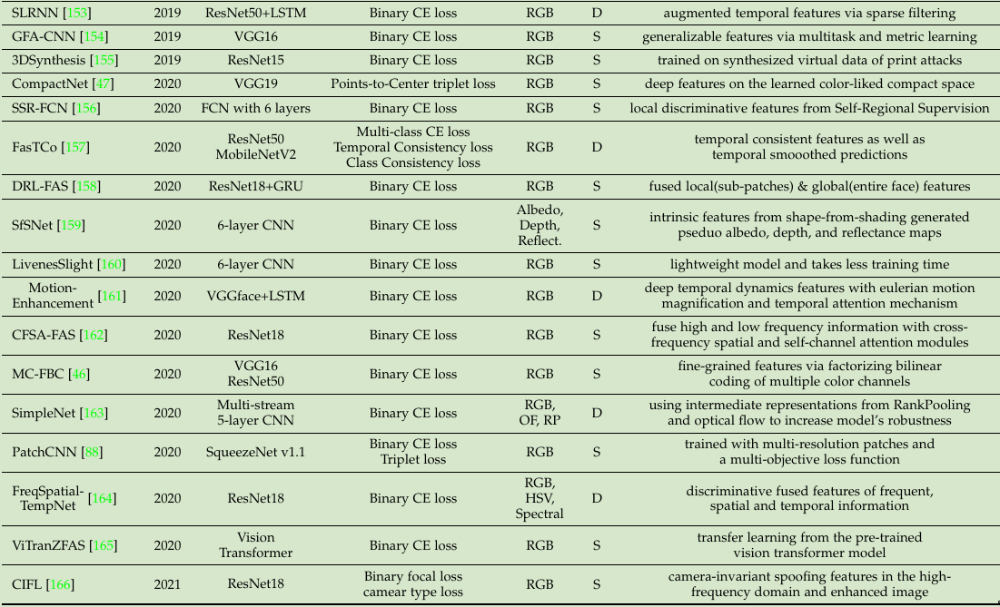

* [Deep FAS with Commercial RGB Camera](#deep-fas-with-commercial-rgb-camera)
  - [Hybrid Method](#hybrid-method)
  - [Common Deep Learning Method](#common-deep-learning-method)
    + [直接使用二分类总结](#直接使用二分类总结)
    + [像素级监督](#像素级监督)
      * [基于辅助任务的像素级监督](#基于辅助任务的像素级监督)
      * [基于生成模型的像素级监督](#基于生成模型的像素级监督)

 

## Deep FAS with Commercial RGB Camera

### Hybrid Method
1. 采用人工设计的特征作为CNN输入
2. 基于CNN提取的feature再提取人工特征进行处理
3. 人工设计的特征与CNN的特征融合进行判断

**三种设计的结构**
 

**Hybrid Method Summary**
 

### Common Deep Learning Method
1. 直接使用二分类binary cross-entropy loss回归
2. 具有辅助任务的像素级监督
3. 生成模型

**三种设计的结构**
 

#### 直接使用二分类总结
 
 

#### 像素级监督
由于直接使用二分类回归的深度学习模型可能很容易学习不可靠的模式（例如，屏幕挡板）。
相比之下，**像素级监督可以为更好的内在特征学习提供更细粒度和上下文相关的任务线索**。

##### 基于辅助任务的像素级监督
基于物理线索和区别性设计理念，开发了辅助监督信号，如**伪深度标签(pseudo depth labels)、二进制掩码标签和反射贴图**，用于真实/欺骗线索描述。

- 根据人的先验信息，大部分PAs是没有面部深度信息的，所以一些工作采用像素级的伪深度标签作为辅助信息训练网络，使得对于live face预测出深度信息，对于spoof预测的深度信息为0
  * DepthNet,利用深度信息的多尺度FCN
  * CDL,a contrastive depth loss
  * CDCN,central difference convolutional
- 为每个训练样本合成3D形状标签成本高昂且不够精确，这也缺乏真实深度PAs的合理性（例如3D面具和人体模型）。
相比之下，二进制掩码标签更容易生成，并且更易于推广到所有PA

##### 基于生成模型的像素级监督

