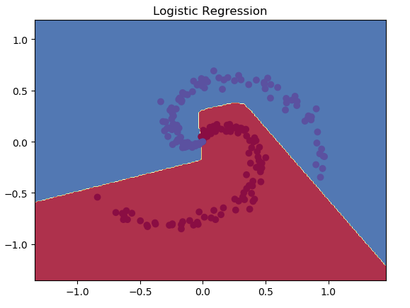

## Loss Function
### Softmax
$L_{S}=-\frac{1}{m} \sum_{i=1}^{m} \log \left(\frac{e^{W_{y_{i}}^{T} x_{i}+b_{y_{i}}}}{\sum_{j=1}^{n} e^{W_{j}^{T} x_{i}+b_{j}}}\right)$

 
 

传统的Softmax仍存在着很大的类内距离, 这种方式主要考虑样本是否能正确分类，缺乏类内和类间距离的约束。

### Center loss
$L=L_{S}+L_{C}=-\frac{1}{m} \sum_{i=1}^{m} \log \left(\frac{e^{W_{y_{i}}^{T} x_{i}+b_{y}}}{\sum_{j=1}^{n} e^{W_{j}^{T} x_{i}+b_{j}}}\right)+\frac{\lambda}{2} \sum_{i=1}^{m}\left\|x_{i}-c_{y_{i}}\right\|^{2}$

 
- Center Loss的整体思想是希望一个batch中的每个样本的feature离feature 的中心的距离的平方和要越小越好，
也就是类内距离要越小越好。
- Center Loss考虑到了使得类内紧凑，却不能使类间可分

### A-Softmax Loss(SphereFace)
Center Loss考虑到了使得类内紧凑，却不能使类间可分，而Contrastive Loss、Triplet Loss增加了时间上的消耗

在Softmax中$W^{T} x=\|W\| \cdot\|x\| \cdot \cos \theta$可得到：

$L_{S o f t m a x}=-\frac{1}{m} \sum_{i=1}^{m} \log \left(\frac{e^{\left\|W y_{i}\right\| \cdot\left\|x_{i}\right\| \cdot \cos \theta_{y_{i}}+b_{y_{i}}}}{\sum_{j=1}^{n} e^{\left\|W_{j}\right\| \cdot\left\|x_{i}\right\| \cdot \cos \theta_{j}+b_{j}}}\right)$

作者对其进行改进，在中约束了$\|\mathrm{W}\|=1$和$\mathbf{b j}=\mathbf{0}$, 
并将$e^{\left\|x_{i}\right\| \cdot \cos \theta_{y_{i}}}$从$\sum_{j=1}^{n} e^{\left\|x_{i}\right\| \cdot \cos \theta_{j}}$区分出来, 
就是为了让特征学习到更可分的角度特性。通过这样的损失函数学习，可以使得学习到的特征具有更明显的角分布，因为决策边界只与角相关。

$L_{\text {modified }{0}}=-\frac{1}{m} \sum_{i=1}^{m} \log \left(\frac{e^{\left\|x_{i}\right\| \cdot \cos \theta_{i}}}{e^{\left\|x_{i}\right\| \cdot \cos \theta_{y_{i}}+} \sum_{j=1, j \neq y_{i}}^{n} e^{\left\|x_{i}\right\| \cdot \cos \theta_{j}}}\right)$

原始softmax的目的是$W_{1} * x>W_{2} * x$，即$\|W 1\| *\|x\| * \cos (\theta 1)>\|W 2\| *\|x\| * \cos (\theta 2)$, 从而得到x的正确分类。当$\|\mathrm{W}\|=1$和$\mathbf{b j}=\mathbf{0}$时，
即$\cos (\theta 1)>\cos (\theta 2)$（cos为单调递减函数, $\theta \in\left[0, {\pi}\right]$）。

如果使用$\cos \left(t \theta_{1}\right)>\cos \left(\theta_{2}\right)$判定, 这样判定规则更严格，
将同类数据压缩到一个紧致空间，同时拉大类间间距；
当$\theta_{1}<\frac{\theta_{2}}{t}$才会判定为类别1；

$L_{\text {modified }{1}}=-\frac{1}{m} \sum_{i=1}^{m} \log \left(\frac{e^{\left\|x_{i}\right\| \cdot \cos \left(t \cdot \theta_{y_{i}}\right)}}{e^{\left\|x_{i}\right\| \cdot \cos \left(t \cdot \theta_{y_{i}}\right)}+\sum_{j=1, j \neq y_{i}}^{n} e^{\left\|x_{i}\right\| \cdot \cos \theta_{j}}}\right), \theta_{y_{i}} \in\left[0, \frac{\pi}{t}\right]$

由于cosθ在[0,π]上单调递减，因此θ有上界，为了使得这个函数随角度单调递减，作者构造一个函数去代替cosθ;

$L_{\text {SphereFace }}=-\frac{1}{m} \sum_{i=1}^{m} \log \left(\frac{e^{\left\|x_{i}\right\| \cdot \varphi\left(\theta_{y_{i}}\right)}}{e^{\left\|x_{i}\right\| \cdot \varphi\left(\theta_{y_{i}}\right)}+\sum_{j=1, j \neq y_{i}}^{n} e^{|| x_{i}|| \cdot \cos \theta_{j}}}\right), \theta_{y_{i}} \in\left[0, \frac{\pi}{t}\right]$

$\varphi\left(\theta_{y_{i}}\right)=(-1)^{k} \cos \left(t \cdot \theta_{y_{i}}\right)-2 k, \theta_{y_{i}} \in\left[\frac{k \pi}{t}, \frac{(k+1) \pi}{t}\right], k \in[0, t-1]$

在SphereFace的实际训练过程中，作者发现引入Softmax约束可以保证模型的收敛性。因此，对φ(θyi)函数做了变更，并同时用参数λ来控制二者的比重。

$\varphi\left(\theta_{y_{i}}\right)=\frac{(-1)^{k} \cos \left(t \cdot \theta_{y_{i}}\right)-2 k+\lambda \cdot \cos \left(\theta_{y_{i}}\right)}{1+\lambda}$

后续的F-Norm SphereFace对SphereFace做了更新，仅注重从数据中得到的角度信息，而不考虑特征向量的值，所以采用了s=64作为特征归一化参数替代了||x||，因此公式更新为： 

$L_{F-N o r m-S p h e r e F a c e}=-\frac{1}{m} \sum_{i=1}^{m} \log \left(\frac{e^{s \cdot \varphi\left(\theta_{y_{i}}\right)}}{e^{s \cdot \varphi\left(\theta_{y_{i}}\right)}+\sum_{j=1, j \neq y_{i}}^{n} e^{s \cdot \cos \theta_{j}}}\right), \theta_{y_{i}} \in\left[0, \frac{\pi}{t}\right]$

而这种采用了s=64作为特征归一化参数替代了||x||||x||的思想也被Cosine Loss和Arcface Loss沿用，即相对于距离信息更加关注角度信息。

### Cosine Margin Loss

### Angular Margin Loss(ArcFace)

### Circle loss

### MagFace

