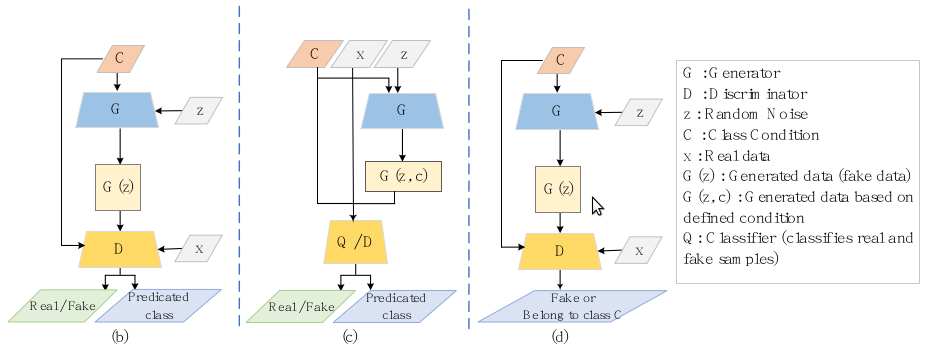

* [相关工作](#相关工作)
  - [GANs结构与公式](#gans结构与公式)
  - [GANs的挑战](#gans的挑战)
  - [GAN的发展改进方向](#gan的发展改进方向)
  - [GANs](#gans)
    + [Basic GAN](#basic-gan)
    + [Conditional GAN](#conditional-gan)
    + [Auto-Encoders GAN](#auto-encoders-gan)
    + [Progressive and Auxiliary Classifier GAN](#progressive-and-auxiliary-classifier-gan)
    + [Adversarial Domain Adaptation](#adversarial-domain-adaptation)

## 相关工作
### GANs结构与公式
 
 
最开始GAN是用的FC层，后来随着CNN的发展转变到使用CNN。

### GANs的挑战
- Mode collapse
  * 当G将各种不同的输入映射到相同的输出时，会发生模式崩溃。
- Vanishing gradients
  * 为了优化GAN的训练，G和D都需要产生有价值的反馈。
  * 训练有素的D将损失函数压缩为0，因此梯度近似为零，这会向G提供少量反馈，导致学习速度减慢或完全停止。
  * 同样，不准确的D会产生错误的反馈，误导G。
- Convergance
  * 虽然已经证明存在一个全局Nash均衡，但达到这个均衡并不简单。
  * GAN经常启动振荡或周期性行为，并且容易收敛到局部Nash均衡，这在主观上可能远离全局均衡。

### GAN的发展改进方向

### GANs
#### Basic GAN

#### Conditional GAN

- `infoGAN` and `ACGAN`
- `BAGAN`

#### Auto-Encoders GAN

- Encoder-Decoder结构可以很好的学习到决定性的mapping, 可以很好的复原图片。
- Auto-Encoders生成的图片是模糊的但是模型是有效率且精确的。
- loss
  
- Auto-Encoders中D使用`reconstruction loss` 检查生成的样本与真实样本的相似程度，并指导G生成更多相似样本

- BiGAN(上图b)
  * 将生成的图片映射回隐式空间
  * 使用D中的编码器作为特征捕获工具
- AGE(上图c)
  * 在生成器G中使用编码器
  * loss应用在生成器G和编码器之间
  * 该网络不需要判别器D
  * `R`表示重建损失reconstruction loss
  * G的目标是减少隐式分布`z`与合成数据分布的差距
  * 编码器是最大化`z`与`E(G(z))`的差距
- BEGAN(上图d)
  * 使用GAN用于image matting图像抠图
  * 在判别器D中采用了auto-encoder结构

#### Progressive and Auxiliary Classifier GAN
- progressive(渐进式) GAN，扩展了标准网络的体系结构，思想来自`progressive network`;
- `Pioneer networks`中将渐进式GAN引入到auto-encoder中进行图像重建;
- Auxiliary  classifier GAN
  
  * 为了提高GAN在半监督学习中的性能，在鉴别器中添加一个额外的精确辅助分类器。
  * 其中`C`是auxiliary classifier

#### Adversarial Domain Adaptation

