## Basic GAN
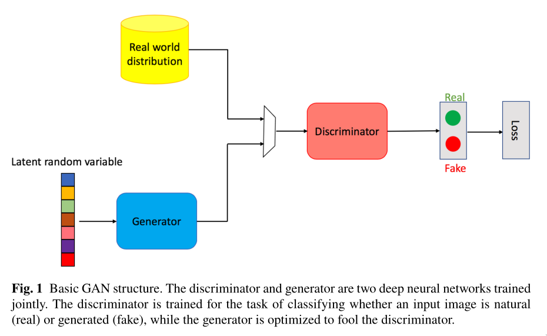

- 损失函数
  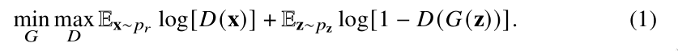
  * 首先固定生成器参数优化一轮判别器D
    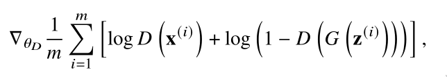
  * 然后固定判别器参数优化一轮生成器G
    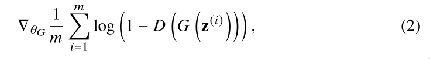
  * 优化交替进行

## GAN的优点和问题

- 优点
  * 相比于VAEs生成模糊的图片，GAN能够生成更自然、质量更高的图片
  * 潜在随机变量大小不受限制，丰富了生成器搜索空间
  * 与其他可能有架构限制的生成模型不同，GAN框架可以支持许多不同的生成器网络。例如，VAEs在生成器的第一层使用高斯函数进行强制。

- 问题
  * 模型的崩塌：就有可能训练出来的GAN只学习到了数据集的一部分分布，而没有学习到全部的分布
  * 梯度消失：当判别器训练的很好，能够较好的分辨真实图片与生成图片时，在接下来训练生成器G时反向传播的梯度很小
  * 不稳定：模型(𝜃𝐷或𝜃𝐺)参数波动，在训练期间通常不稳定，生成器很少能输出高质量的图像

### 模型崩塌
当训练生成MNIST数据集中的数字时，模型崩塌的现象就是只能生成0-9数字中的一部分，例如6，如下图Fig.2所示，上面由一个训练较好的GAN生成，下面的则为模型崩塌的GAN生成。

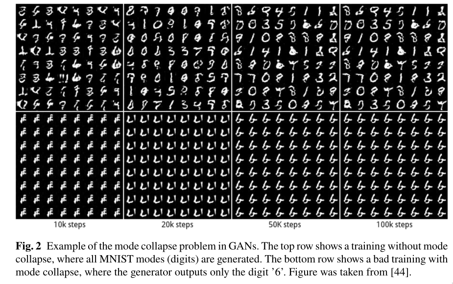

### 梯度消失
当D达到最优时，也就相当于下面的公式等于0
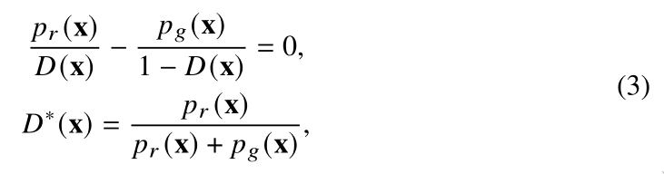
其中x是真是输入数据，D\*(x)是最优的判别器, pr(x)是真实数据的分布，pg(x)是生成数据的分布.

将D\*(x)带入Eq.(1), 则G的损失为：
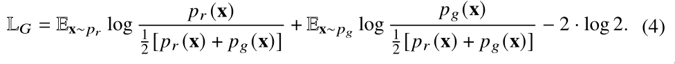

再经过KL差异与JS差异的换算得到G的损失为：
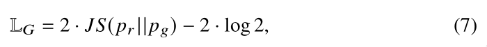

- Tips
  * KL差异公式：
    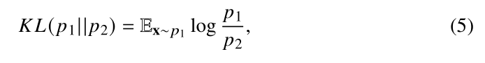
  * JS差异公式：
    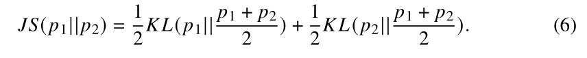
  * KL不是对称的(即KL(p1||p2) ≠ KL(p2||p1))，JS是对称的

也就是说当D\*(x)存在时，G的损失可以看做是**最小化pr 与pg的JS差异**

如下图Fig.3所示(图中pr 是真实图片分布), 不同分布之间的JS差异，或许能够解释GAN训练时的不稳定
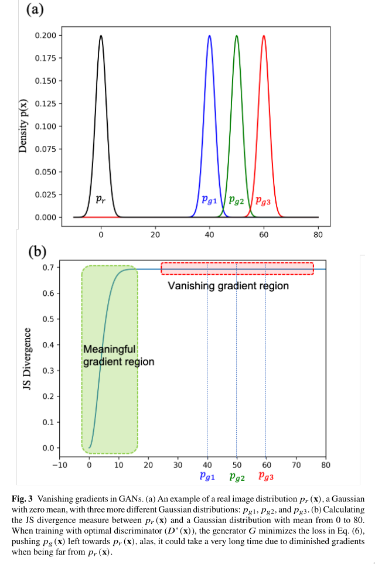
G的损失的优化目标是将图中的分布往左边拉, **可以看到，右边的梯度非常小**
- **因此当D\*(x)存在时，会存在梯度消失的问题(当pr与pg分布差距较大时)**

因此为了解决这个问题, 有人提出了改变原本的对抗损失，将最小化**log(1 - D(G(z)))**(如Eq.(2))改成了最大化**log(D(G(z)))**

- **但是该方案能够获得更高的梯度，但是会造成模型崩塌的问题**

当存在D\*(x)时，KL(p1||p2)可以表示为：
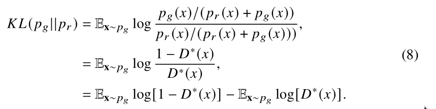
变换一下公式的两边得到：
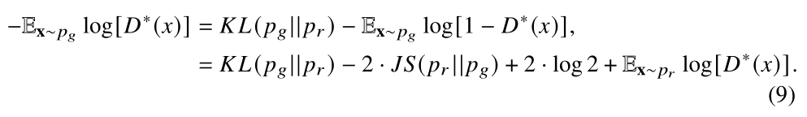
因此G的对抗损失主要受前两个部分的影响(后两部分为常量), 又由于JS(p1||p2)∈\[0, log2\] (Fig.3(b)), 所以G的对抗损失主要受KL(pg||pr) (reversed KL)的影响，然后又由于KL(pg||pr) ≠ KL(pr||pg);

**因此被reversed KL优化的pg 与被KL优化的pg是完全不一样的**, 如下图Fig.4所示：

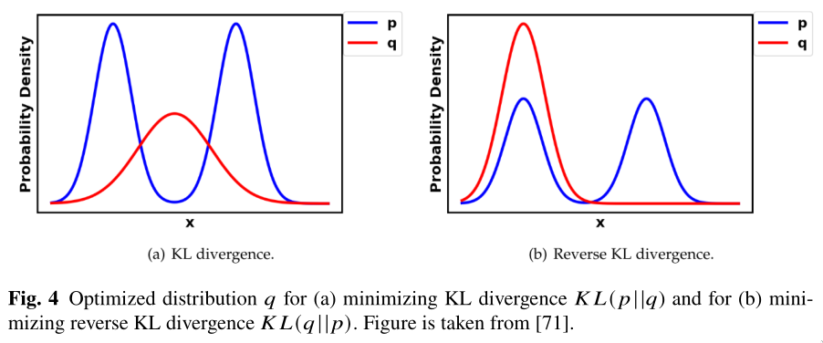
当优化KL(pr||pg)时`q`会学习所有的`p`的模式往中间靠(Fig.4(a)), 然而reverse KL优化，`q`会选择一个单独的模式`q`(Fig.4(b))。

总的来说就是，使用Eq.(1)作为G的损失函数会造成梯度消失问题，使用Eq.(9)作为G的损失函数则会造成模型崩塌 

### 不稳定与图像质量
由于在训练过程中，Eq.(1)在开始之后一直保持常量(Fig.5(a))，Eq.(8)则来回波动(Fig.5(b))，因此无法通过训练时的损失来判断生成的图像质量，必须停下训练通过模型生成图像之后来判断图像质量
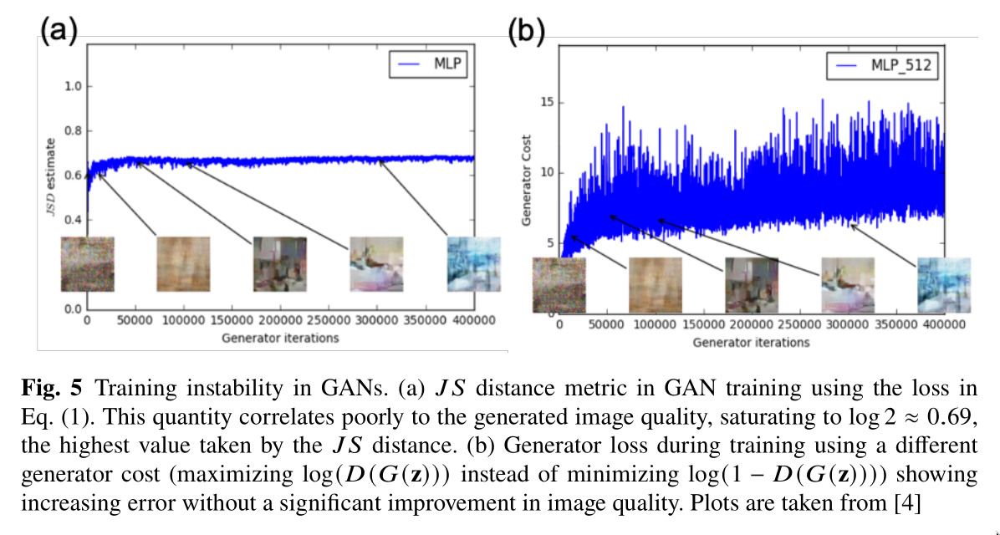

### 问题总结
以下是近年来针对这三个问题的一些**模型改进**与**损失改进**, 左边是模型改进，右边是损失改进，红色表示三个维度都有改进，蓝色表示两个维度有改进，黑色表示单个维度
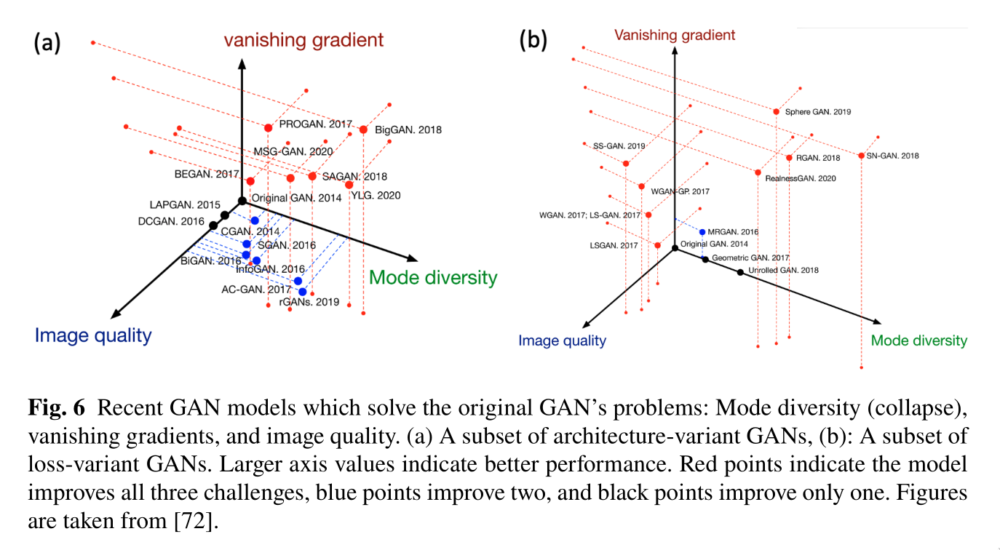

## 改进的GAN架构

### 半监督的GAN(SGAN)
如下图所示，在原本GAN的基础上加上了半监督的思想，在判别器网络上增加了一个分类任务分支，生成器的结构一样；

判别器有两个头，sigmoid负责鉴别真是数据与生成数据，siftmax负责预测分类标签(仅对预测为真实图片的进行预测分类)
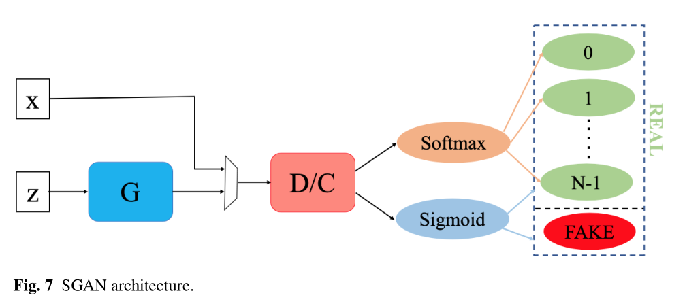

### 有条件的GAN(CGAN)
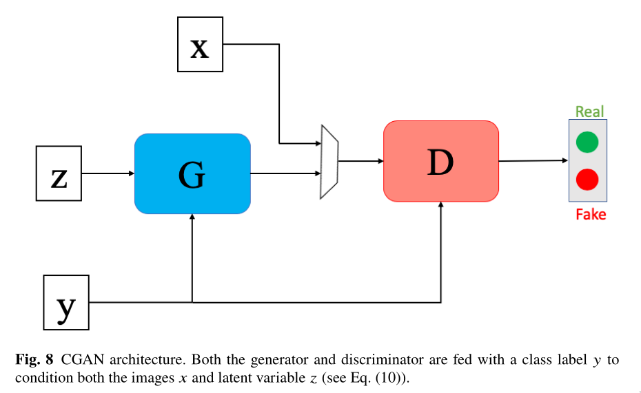
