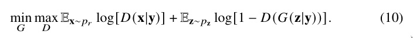
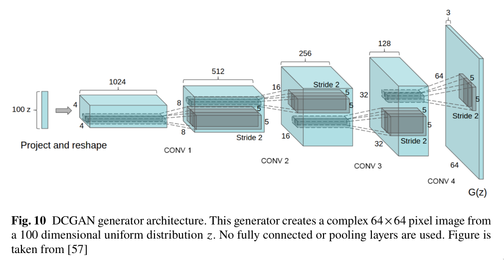
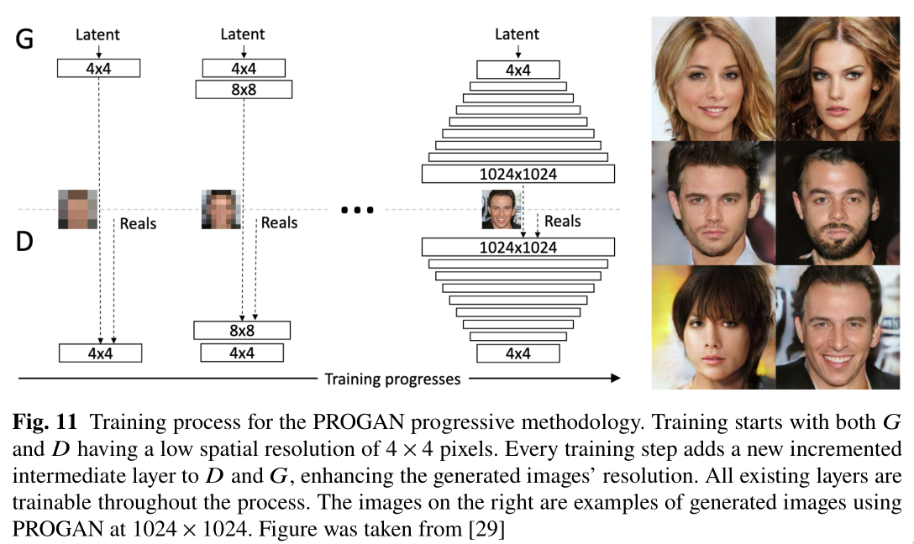
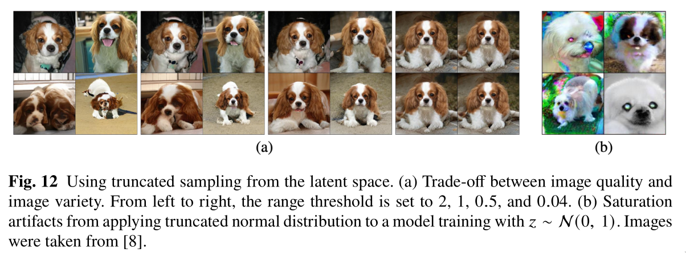
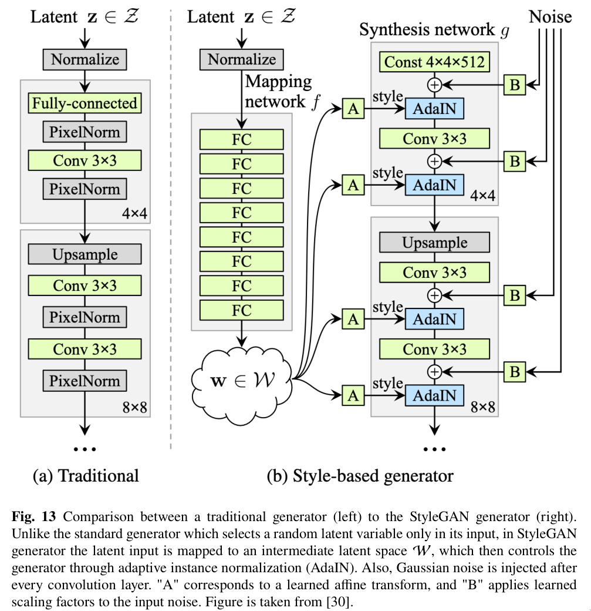
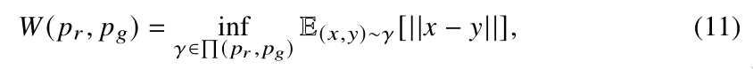

## Basic GAN

- 损失函数
  
  * 首先固定生成器参数优化一轮判别器D
    
  * 然后固定判别器参数优化一轮生成器G
    
  * 优化交替进行

## GAN的优点和问题

- 优点
  * 相比于VAEs生成模糊的图片，GAN能够生成更自然、质量更高的图片
  * 潜在随机变量大小不受限制，丰富了生成器搜索空间
  * 与其他可能有架构限制的生成模型不同，GAN框架可以支持许多不同的生成器网络。例如，VAEs在生成器的第一层使用高斯函数进行强制。

- 问题
  * 模式崩塌：就有可能训练出来的GAN只学习到了数据集的一部分分布，而没有学习到全部的分布
  * 梯度消失：当判别器训练的很好，能够较好的分辨真实图片与生成图片时，在接下来训练生成器G时反向传播的梯度很小
  * 不稳定：模型(𝜃𝐷或𝜃𝐺)参数波动，在训练期间通常不稳定，生成器很少能输出高质量的图像

### 模式崩塌
当训练生成MNIST数据集中的数字时，模式崩塌的现象就是只能生成0-9数字中的一部分，例如6，如下图Fig.2所示，上面由一个训练较好的GAN生成，下面的则为模式崩塌的GAN生成。

### 梯度消失
当D达到最优时，也就相当于下面的公式等于0

其中x是真是输入数据，D\*(x)是最优的判别器, pr(x)是真实数据的分布，pg(x)是生成数据的分布.

将D\*(x)带入Eq.(1), 则G的损失为：

再经过KL差异与JS差异的换算得到G的损失为：

- Tips
  * KL差异公式：
    
  * JS差异公式：
    
  * KL不是对称的(即KL(p1||p2) ≠ KL(p2||p1))，JS是对称的

也就是说当D\*(x)存在时，G的损失可以看做是**最小化pr 与pg的JS差异**

如下图Fig.3所示(图中pr 是真实图片分布), 不同分布之间的JS差异，或许能够解释GAN训练时的不稳定

G的损失的优化目标是将图中的分布往左边拉, **可以看到，右边的梯度非常小**
- **因此当D\*(x)存在时，会存在梯度消失的问题(当pr与pg分布差距较大时)**

因此为了解决这个问题, 有人提出了改变原本的对抗损失，将最小化**log(1 - D(G(z)))**(如Eq.(2))改成了最大化**log(D(G(z)))**

- **但是该方案能够获得更高的梯度，但是会造成模式崩塌的问题**

当存在D\*(x)时，KL(p1||p2)可以表示为：

变换一下公式的两边得到：

因此G的对抗损失主要受前两个部分的影响(后两部分为常量), 又由于JS(p1||p2)∈\[0, log2\] (Fig.3(b)), 所以G的对抗损失主要受KL(pg||pr) (reversed KL)的影响，然后又由于KL(pg||pr) ≠ KL(pr||pg);

**因此被reversed KL优化的pg 与被KL优化的pg是完全不一样的**, 如下图Fig.4所示：

当优化KL(pr||pg)时`q`会学习所有的`p`的模式往中间靠(Fig.4(a)), 然而reverse KL优化，`q`会选择一个单独的模式`q`(Fig.4(b))。

总的来说就是，使用Eq.(1)作为G的损失函数会造成梯度消失问题，使用Eq.(9)作为G的损失函数则会造成模式崩塌 

### 不稳定与图像质量
由于在训练过程中，Eq.(1)在开始之后一直保持常量(Fig.5(a))，Eq.(8)则来回波动(Fig.5(b))，因此无法通过训练时的损失来判断生成的图像质量，必须停下训练通过模型生成图像之后来判断图像质量

### 问题总结
以下是近年来针对这三个问题的一些**模型改进**与**损失改进**, 左边是模型改进，右边是损失改进，红色表示三个维度都有改进，蓝色表示两个维度有改进，黑色表示单个维度

## 改进的GAN架构

### 半监督的GAN(SGAN)
如下图所示，在原本GAN的基础上加上了半监督的思想，在判别器网络上增加了一个分类任务分支，生成器的结构一样；

判别器有两个头，sigmoid负责鉴别真是数据与生成数据，siftmax负责预测分类标签(仅对预测为真实图片的进行预测分类)

### 有条件的GAN(CGAN)
- 在判别器和生成器都添加了额外的图像类别信息
- (x, y, z)首先经过一层神经网络先验，然后在判别器和生成器中进行融合
- 公式与架构如下图所示

### 深度卷积GAN(DCGAN)
- 将池化层用步长>1的卷积代替
- 添加BN层，促进真实图片与生成图片具有相同的统计分布
- ReLU -> LeakyReLU
- ReLU -> Tanh

### Progressive GAN(PROGAN)
- 从4x4开始，随着训练的进行，逐渐在D和G中增加网络层，直到1024x1024
- 这样的架构可以防止网络退化，利用侧边连接的先验知识来提前学习特征

### BigGAN
- 基于Self-attention GAN(SAGAN), 在D和G中采用self-attention机制，来捕获更大的感受野
- BigGAN在此基础上，采用更多的网络参数量(x4)和batch-size(x8)
- 采用`truncation trick`对隐式遍历z进行采样
  * 另外一些模型对z采样可能是 z ~ N(0,1)或者z ~ U(-1, 1)
  * BigGAN训练时采用的是z ~ N(0,1)采样, 当推理时生成图片的时候的z来自一个截断的normal，当值超出范围之后重新采样直到在范围以内
  * 该方法能够提升图像的生成质量(Fig.12(a))，但是对于一些大模型可能会造成一些artifacts(Fig.12(b)), 因此作者采用`Orthogonal Regularization`来使G更顺从截断，使其更平滑

### StyleGAN
- 相比于传统的G的输入是一个随机采样的隐式变量z，styleGAN有以下改进(如图Fig.13所示)：
  * 采用一个可学习的常量输入(W)
  * 通过使用不同的可学习隐式变量在每一层卷积层之间调整图像特征(A)
  * 通过G直接注入可学习的噪声(B)
  * AdaIN -> adaptive instance normalization
- StyleGAN没有改进判别器和损失函数
- StyleGAN展示了更高程度的潜在空间分离，呈现了不同变化因素的更多线性表示，使GAN合成变得更可控
- 还有很多领域，比如说图像编辑，会采用StyleGAN提取图像的隐式特征向量(也就是styleGAN inversion)，然后再对向量进行编辑与修改

## 改进的GAN目标(loss)

### Wasserstein GAN(WGAN)
- 通过EM distance(地球距离)替代GAN原损失，解决了模式崩塌和梯度消失的问题
- Wasserstein distance公式如下：
  
  
