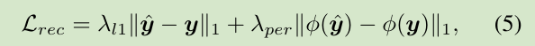

- [Introduction](#introduction)
  + [Face Restoration](#face-restoration)
  + [Generative Priors](#generative-priors)
  + [Channel Split Operation](#channel-split-operation)
- [Methodology](#methodology)
  + [Pipeline](#pipeline)
  + [Degradation Removal Module](#degradation-removal-module)
  + [Generative Facial Prior and Latent Code Mapping](#generative-facial-prior-and-latent-code-mapping)
  + [Channel-Split Spatial Feature Transform](#channel-split-spatial-feature-transform)
- [Model Objectives](#model-objectives)
  + [loss](#loss)
    * [Reconstruction Loss](#reconstruction-loss)
    * [Adversarial Loss](#adversarial-loss)
    * [Facial Component Loss](#facial-component-loss)
    * [Identity Preserving Loss](#identity-preserving-loss)
    * [Total loss](#total-loss)
  + [degradation model](#degradation-model)
- [Experiments and More details](#experiments-and-more-details)

**code**: [https://github.com/TencentARC/GFPGAN](https://github.com/TencentARC/GFPGAN) 

**paper**: [https://arxiv.org/pdf/2101.04061.pdf](https://arxiv.org/pdf/2101.04061.pdf) 

### Introduction
#### Face Restoration

在一般人脸超分辨率技术的基础上，引入两种典型的人脸特异性先验:几何先验和参考先验，进一步提高模型表现。
- 几何先验包括人脸关键点（facial landmarks），人脸分割图（face parsing maps）和人脸成分热力图（facial component heatmaps ）。
  * 存在的问题
    1. 从低质量的图片中很难取得比较准确的几何信息
    2. 它们很难提供纹理方面的信息。
- 参考先验通常依赖于相同身份的参考图像。即从数据库中取得相同或者相似的人脸作为参考（Reference）来复原。
但是这样的高质量的参考图在实际中很难获取。**ECCV20 提出的 DFDNet 工作进一步构建了一个人脸五官的字典来作为参考,
它可以取得更好的效果, 但是会受限于字典的容量, 而且只考虑了五官, 没有考虑整个脸**

论文提出了一种**生成式的人脸先验（GFP）**，用于真实世界的盲人脸图像复原。由于**预训练的人脸生成对抗网络（如styleGAN）所生成的假脸，具有高分辨率，丰富的几何形状、人脸纹理和颜色，这些使到其能够联合用于复原人脸的细节和增强颜色**。

提出了一种GFP-GAN，其包含了**一个退化去除模块和一个预训练的人脸GAN作为人脸先验**。通过直接的潜在代码映射和几个通道分割空间特征变换（CS-SFT）层以粗调方式连接。

#### Generative Priors
预训练过的GAN的生成先验先前被GAN逆映射（GAN inversion）所利用，其主要目的是找到给定输入图像的最接近的隐变量（latent code）。
PULSE迭代优化StyleGAN的隐变量，直到输出和输入之间的距离低于阈值。mGANprior尝试优化多个code，以提高重构质量。
然而，由于低维隐变量不足以指导修复，这些方法通常会产生低保真度的图像。

论文提出的**CS-SFT调制层能够预先结合多分辨率空间特征，以实现高保真度**。此外，论文的GFP-GAN在推理过程中不需要高成本的迭代优化。

#### Channel Split Operation
DPN的双路径结构能够对每条路径进行特征重用和新特征探索，从而提高了DPN的表示能力。
在超分辨率中也采用了类似的思路。论文的CS-SFT层有着相似的精神，但是有着不同的操作和目的。
论文**在一次分裂上采用空间特征变换，将左分裂作为身份特征，以达到很好的真实性和保真度的平衡**。

### Methodology
#### Pipeline
 

#### Degradation Removal Module
图像包含有许多不同的退化因素。论文所提出的退化去除模块，用于提取清晰特征；
本模块基于U-net网络模型，并提高大范围模糊的适应性和生成不同分辨率的特征。利用金字塔复原指导中间结果。
 

#### Generative Facial Prior and Latent Code Mapping
 

#### Channel-Split Spatial Feature Transform
 
 

### Model Objectives
#### loss
- 约束输出y^接近GT y的重建损失
- 恢复真实纹理的对抗损失
- 提出面部组成损失进一步提升面部细节
- 身份保留损失

##### Reconstruction Loss
 

##### Adversarial Loss
生产真实纹理，类似于StyleGAN2，采用了Logistic Loss，训练全局的 Discriminator, 判断人脸是否真实

 

##### Facial Component Loss
使用real与restored patches的Gram matrix statistics计算loss.
Gram matrix statistics(k个向量之间两两的内积)能够的到feature统计信息并且能够有效的捕捉纹理信息；
 
```python
def _comp_style(feat, feat_gt, criterion):
   return criterion(self._gram_mat(feat[0]), self._gram_mat(
        feat_gt[0].detach())) * 0.5 + criterion(
            self._gram_mat(feat[1]), self._gram_mat(feat_gt[1].detach()))
```

##### Identity Preserving Loss
 

##### Total loss
 

#### degradation model
 

### Experiments and More details
see [paper](https://arxiv.org/pdf/2101.04061.pdf) and [code](https://github.com/TencentARC/GFPGAN).
