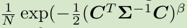

- [Introduction](#introduction)
- [Contribution](#contribution)
- [Classical Degradation Model](#classical-degradation-model)
  + [Blur](#blur)
  + [Noise](#noise)
  + [Resize(Downsampling)](#resizedownsampling)
  + [JPEG compression](#jpeg-compression)
- [High-order Degradation Model](#high-order-degradation-model)
- [Ringing and overshoot artifacts](#ringing-and-overshoot-artifacts)
- [Networks and Training](#networks-and-training)
  + [ESRGAN generator](#esrgan-generator)
  + [U-Net discriminator with spectral normalization (SN)](#u-net-discriminator-with-spectral-normalization-sn)
  + [The training process](#the-training-process)

- **paper**: [https://arxiv.org/pdf/2107.10833.pdf](https://arxiv.org/pdf/2107.10833.pdf) 
- **code**: [https://github.com/xinntao/Real-ESRGAN](https://github.com/xinntao/Real-ESRGAN) 

 
### Introduction
单图像超分辨率(SR)是一个活跃的研究课题，旨在从其低分辨率(LR)对应的图像中重建一个高分辨率(HR)图像。
自SRCNN的开创性工作以来，深度卷积神经网络(CNN)方法在SR领域带来了繁荣的发展。然而，（研究背景）大多数方法：
假设有一个理想的双边降采样核，这不同于真实的降解。这种退化不匹配使得这些方法在现实场景中不实际。

盲超分辨率旨在恢复遭受未知和复杂退化的低分辨率图像。根据潜在的退化过程，现有的方法可以大致分为**显式建模和隐式建模**。
**经典的退化模型，包括模糊、降采样、噪声和JPEG压缩，被广泛应用于显式建模方法**。然而，现实世界的降解通常过于复杂，无法用多次退化的简单组合来建模。
因此，这些方法在现实世界的样本中很容易失败。
**隐式建模方法利用生成对抗网络(GAN)的数据分布学习来获得退化模型**。但是，它们**仅限于训练数据集中的退化，并且不能很好地推广到分布外的图像**。

真正复杂的退化通常来自不同退化过程的复杂组合，如相机成像系统、图像编辑和互联网传输。例如：
- 拍照时，照片可能会有几个退化，如相机模糊、传感器噪声、锐化伪影和JPEG压缩
- 编辑并上传到一个社交媒体应用程序，将进一步的压缩和不可预测的噪音
- 当图像在互联网上共享多次时，上述过程会变得更加复杂。

因此，将经典的“一阶”降解模型（classical “first-order” degradation model）扩展到现实世界降解的“高阶”降解模型（“high-order” degradation modeling），
即降解用几个重复的降解过程建模，每个过程都是经典的降解模型。根据经验，采用了一个**二阶降解过程（second-order degradation process ）**，
以实现简单性和有效性之间的良好平衡。最近的一项工作，也提出了一种随机洗牌策略（ a random shufflfling strategy）来合成更实用的降解。
然而，它仍然涉及到固定数量的降解类型，而其背后的合理性尚不清楚。
相反，高阶降解建模更灵活，并试图模拟真实的降解生成过程。
此外，进一步在合成过程中加入了sinc滤波器，以模拟常见的振铃和超调伪影（common ringing and overshoot artifacts）。

由于退化空间远远大于ESRGAN，训练也变得具有挑战性。具体来说:

- 鉴别器需要更强大的能力来区分真实度和复杂的训练输出，而来自鉴别器的梯度反馈需要更准确地提高局部细节。因此，**将ESRGAN中的VGG风格的鉴别器改进为UNet设计**。
- U-Net的结构和复杂的退化也增加了训练的不稳定性。因此，采用**spectral normalization regularization(SN)正则化来稳定训练过程**。

配备了专门的改进，能够轻松地训练Real ESRGAN，实现局部细节增强和伪影抑制的良好平衡。

### Contribution
- **提出了一个高阶(二阶)降解过程来建模实际的降解**，并**利用sinc滤波器来建模常见的ringing and overshoot artifacts**。
- 采用了几个必要的修改(例如，**具有sn的U-Net鉴别器**)来提高鉴别器的能力和稳定训练过程。
- 使用纯合成数据训练的Real-ESRGAN能够恢复大多数真实图像，并实现比以前的工作更好的视觉性能，使其在现实应用中更加实用。

### Classical Degradation Model
Blind SR的目标是将带有未知和复杂的退化的低分辨率图像恢复成高分辨率图像。通常采用经典的退化模型（degradation model）来合成低分辨率的输入
- GT图像y与模糊核k进行卷积。
- 对标度因子r进行下采样操作。
- 添加噪声n，可以得到低分辨率的x。
- 降解过程D
- JPEG压缩也广泛应用于JPEG压缩。
 

#### Blur
通常将模糊退化建模为与线性模糊滤波器（核）的卷积。Isotropic和anisotropic高斯滤波器是常见的选择。
对于核大小为2t+1的高斯模糊核k，从高斯分布中采样其(i，j)∈[−t，t]元素，形式为：
- Σ为协方差矩阵，C为空间坐标，N为归一化常数。协方差矩阵可以进一步表示如下：
- σ1和σ2是沿两个主轴的标准差（即协方差矩阵的特征值）
- R是旋转矩阵 ,θ为旋转度
- 当σ1=σ2时，k是各向同性高斯模糊核；否则k是各向异性核。
 
Discuss：虽然高斯模糊核被广泛用于建模模糊退化，但它们可能不能很好地近似真实的相机模糊。为了包含更多样化的核形状，
进一步采用了generalized Gaussian blur kernels和plateau-shaped distribution。
probability density function (pdf)
 
 

#### Noise
- addictive Gaussian noise
  * addictive Gaussian noise的概率密度函数等于高斯分布的概率密度函数。噪声强度由高斯分布的站立偏差（即sigma值）控制。
  当RGB图像的每个通道都有独立的采样噪声时，合成噪声为颜色噪声。通过对所有三个通道使用相同的采样噪声来合成灰色噪声
- 泊松噪声（ Poisson noise or shot noise）遵循泊松分布。
  * 泊松噪声的强度与图像强度成正比，且不同像素处的噪声是独立的

#### Resize(Downsampling)
下采样是在SR中合成低分辨率图像的基本操作。同时考虑降采样和上采样，即调整大小操作。
有几种调整大小的算法：
- 最近邻插值(nearest-neighbor)
- 面积调整大小(area resize)
- 双线性插值(bilinear)
- 双三次插值(bicubic)

不同的调整大小操作会带来不同的效果——有些产生模糊的结果，而有些可能会输出过过度伪影的过锐图像。
为了包含更多样化和更复杂的调整大小效应，考虑了从上述选择中进行随机调整大小的操作。
**由于最近邻插值引入了错位问题，排除了它，只考虑了面积、双线性和双三次运算**。

#### JPEG compression
JPEG压缩是一种常用的数字图像有损压缩技术。它首先将图像转换为YCbCr颜色空间，并对色度通道进行降采样。
然后将图像分割成8个×8个块，每个块用二维离散余弦变换(DCT)进行变换，然后对DCT系数进行量化。block artifacts通常由JPEG压缩引入。

压缩图像的质量由质量因子q∈[0,100]决定，其中较低的q表示较高的压缩比和较差的质量。使用PyTorch实现-[DiffJPEG](https://github.com/mlomnitz/DiffJPEG)。

### High-order Degradation Model
 
 

### Ringing and overshoot artifacts
 
在图像中，环形伪影通常出现在虚假的边缘，它们在视觉上看起来像乐队或“鬼魂”。 超调伪影通常与环形伪影结合，这些伪影表现为边缘过渡时的跳跃
主要导致这些伪影的原因在于：信号是带限的，没有高频。这些伪影非常常见，通常由锐化算法、JPEG压缩等产生。
论文使用**sinc滤波器， 一个切断高频的理想滤波器，来合成训练对的环形和超调伪影**。sinc滤波器核可以表示为：
 
其中（i、j）为核坐标，ωc为截止频率，J1为第一类的一阶贝塞尔函数

**在两个方面采用sinc滤波器**：模糊过程和合成的最后一步。
最后一个sinc滤波器和JPEG压缩的顺序被随机交换是为了覆盖更大的退化空间，因为一些图像可能首先被过度锐化（带有超调伪影），然后进行JPEG压缩；
而有些图像可能首先进行JPEG压缩，然后进行锐化操作。

### Networks and Training
#### ESRGAN generator
采用与ESRGAN相同的生成器( SR网络)， 即具有多个residual-in-residual块(RRDB)的深度网络，如图4所示，还扩展了原始的×4ESRGAN架构， 
以×2和×1的比例因子执行超分辨率。由于ESRGAN是一个较重的网络，首先使用pixel-unshuffle（pixel-shuffle的逆操作）来减小空间大小和扩大通道大小，
然后输入到主ESRGAN体系结构中。因此，大部分的计算是在较小的分辨率空间内进行的，这可以减少GPU内存和计算资源的消耗。
 

#### U-Net discriminator with spectral normalization (SN)
由于Real-ESRGAN的目标是**解决比ESRGAN更大的退化空间**，因此ESRGAN中鉴别器的原始设计已不再合适。
具体来说，Real-ESRGAN中的鉴别器对复杂的训练输出需要更大的鉴别能力。它不需要区分全局样式， 而是需要为局部纹理产生准确的梯度反馈。
因此，将ESRGAN中的VGG风格的鉴别器改进为具有跳层连接的U-Net设计。U-Net输出每个像素的真实度值，并可以向生成器提供详细的过像素反馈。
 

#### The training process
训练过程分为两个步骤：
1. 使用L1 loss训练一个PSNR-oriented模型，叫做Real-ESRNet。
2. 然后，使用训练后的PSNR-oriented模型作为生成器的初始化，并结合L1损失、感知损失和GAN损失来训练Real-ESRGAN。

- **训练对池**：为了提高训练效率，所有的降解过程都在PyTorch中实现，从而能够动态地合成训练对。
然而，一批处理限制了一批合成降解的多样性。例如，一个批处理中的样本不能具有不同的调整大小缩放因子。
因此，使用一个训练对池来增加一个批次的降解多样性。在每次迭代中，从差训练对中随机选择训练样本，形成训练批。在实施中将池的大小设置为180。

- **锐化GT image**：进一步展示了一个训练技巧，以从视觉上提高锐度，同时不引入可见的伪影。锐化图像的一种典型方法是使用后处理算法，如不锐利的掩蔽(USM)。
然而，该算法倾向于引入过调伪影。根据经验发现，在训练过程中锐化GT可以实现更好的锐度和超调伪影抑制的平衡。
论文将用清晰的GT图像训练的模型表示为Real-ESRGAN+(比较如图7所示）。
 

More details see [paper](https://arxiv.org/pdf/2107.10833.pdf) and [code](https://github.com/xinntao/Real-ESRGAN)
