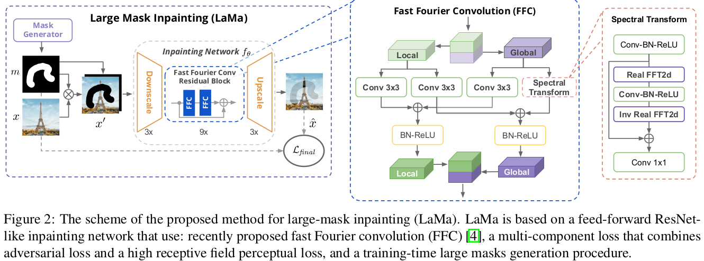
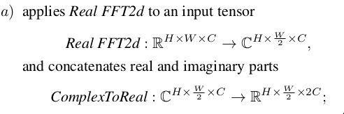
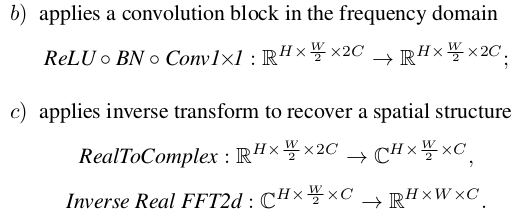
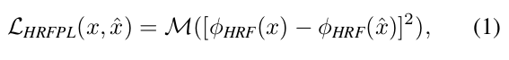
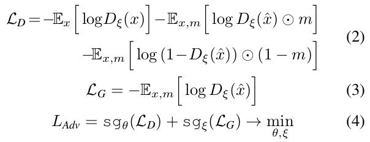
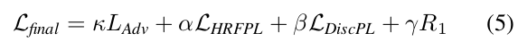
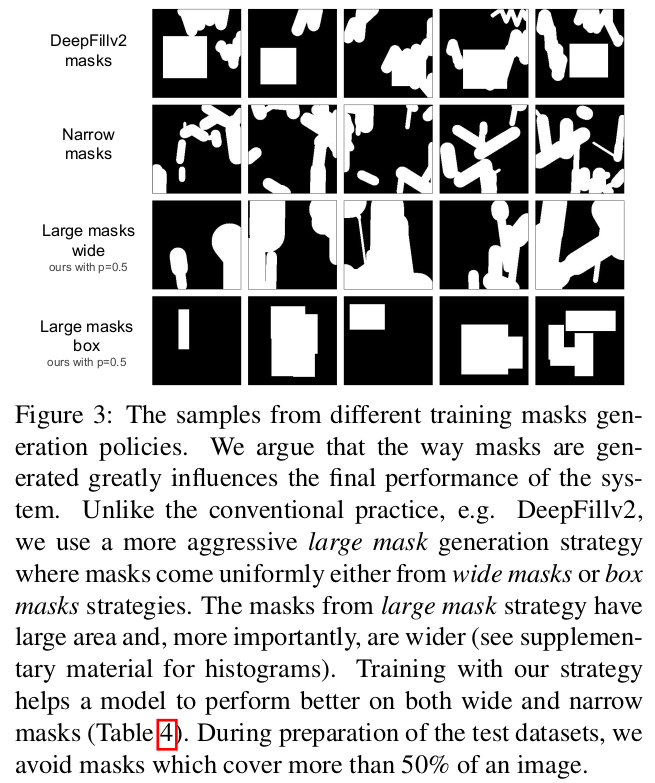

* [贡献](#贡献)
* [整体架构](#整体架构)
* [方法](#方法)
  - [FFC](#ffc)
  - [Loss functions](#loss-functions)
    + [高感受野感知损失](#高感受野感知损失)
    + [对抗损失](#对抗损失)
    + [最终的损失](#最终的损失)
  - [Generation of masks during training](#generation-of-masks-during-training)
* [Big LaMa](#big-lama)
* [相关工作](#相关工作)

- **paper**: [https://arxiv.org/pdf/2109.07161v2.pdf](https://arxiv.org/pdf/2109.07161v2.pdf)
- **code**: [https://github.com/saic-mdal/lama](https://github.com/saic-mdal/lama)

## 贡献
1. 提出一个基于`fast Fourier convolutions(FFCs)`的网络结构，FCCs允许网络结构在早期stage也**能够捕获全局的感受野**
2. 提出了基于**高感受野**语义分割网络的感知loss
3. 为训练时的mask生成引入了更好的策略

## 整体架构

- 上图仅为网络的生成器
- 训练的时候还有判别器，以及高感受野loss的提取特征网络

## 方法
### FFC
- FFC是基于channel-wise的FFT，能够拥有包含全图的感受野
- 如上图所示FFC模块分为两个分支，`local branch`与`global branch`
- 其中`global branch`包含`real FFT`操作
- FFC步骤

- 由于FFC的全图感受野，生成器在早期stage就能够捕获全局信息，这对于高分辨率图像补全很重要

### Loss functions
#### 高感受野感知损失

- 感知损失是评估预测图片和原图提取的特征之间的距离(特征由一个预训练好的网络提取)
- large-mask修复的重点转移到对整体结构的理解上。因此，作者认为使用快速增长的感受野的基础网络是很重要的。
- ϕHRF(x)可以为`Fourier`或者`Dilated`卷积
- Pretext problem
  * 对于提取特征的网络选择也很重要
  * 选择分割模型作为感知损失的backbone或许可与帮助专注于高级语义信息
  * 而分类网络则更专注纹理信息，或许会引入偏差，对高级语义信息有害

#### 对抗损失

- 使用对抗损失来帮助网络学习生成局部细节信息
- 其中x̂ = fθ(x')表示网络补全的图片，作为fake，x为原图，作为true
- sgvar为停止梯度流

#### 最终的损失

- 其中LDiscPL为判别器提取特征的匹配损失, 可以稳定训练
- R1为正则项

### Generation of masks during training

- 该策略统一使用来自多边形链的样本，该多边形链由高随机宽度（宽遮罩）和任意纵横比的矩形（长方体遮罩）展开

## Big LaMa
- 在3个维度提升LaMa
  * 生成器的深度
  * 训练数据集
  * batch-size大小

## 相关工作
- 图像修复领域在深度学习中最开始是使用`encode-decoder`架构+对抗的形式
- 另一种类型是基于`U-Net`的架构
- 但无论哪种形式，都主要关心网络对局部信息和全局信息的理解
- 因此提出空洞卷积来提升感受野, 除此之外，还分别使用两个判别器来分别激励全局和局部的连贯一致性
- 有人建议在补全网络中不同感受野使用分支
- 在全局层次，也有人引入了一个由粗到细的框架，包含两个网络(two-stage), 第一个网络首先提取全局信息，第二个网络在此基础上校准局部细节
