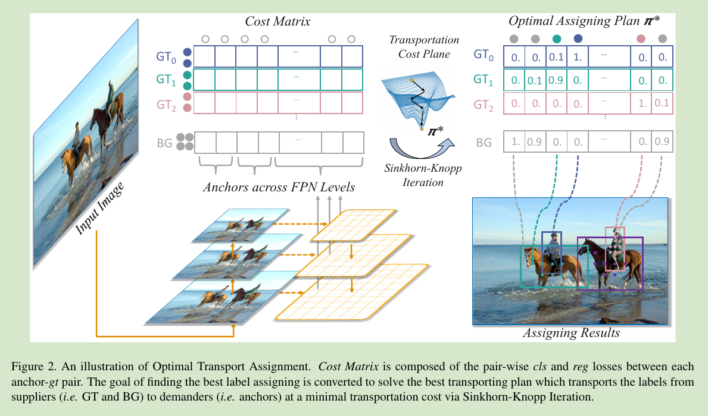
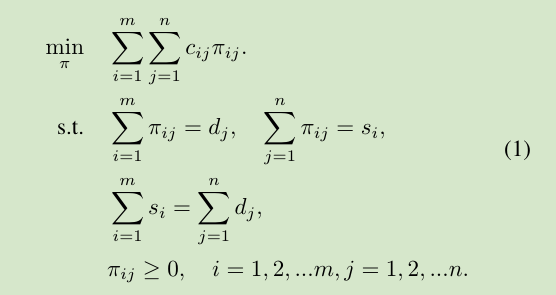
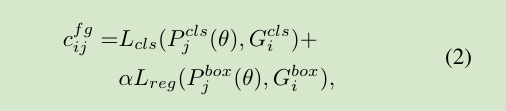
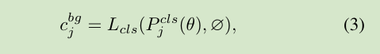
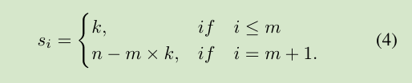
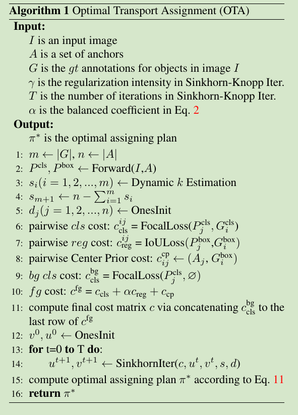
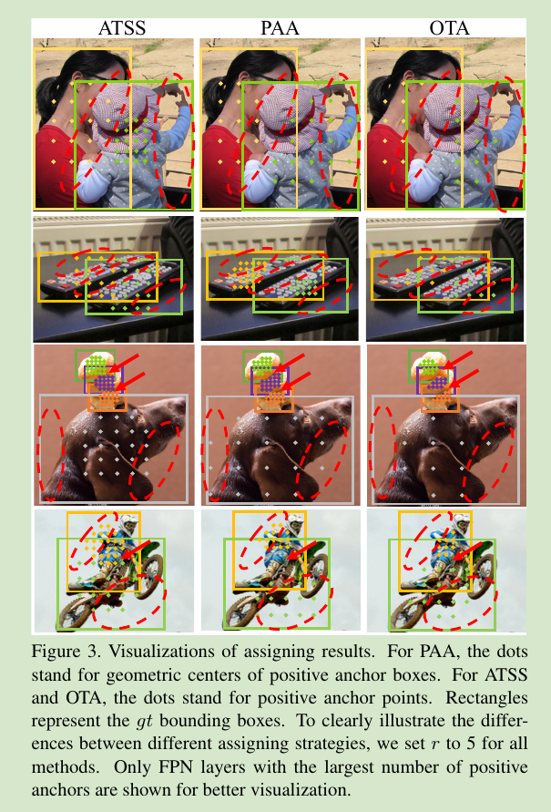
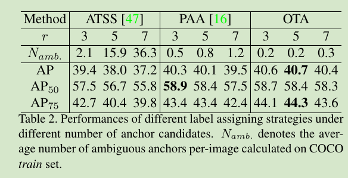
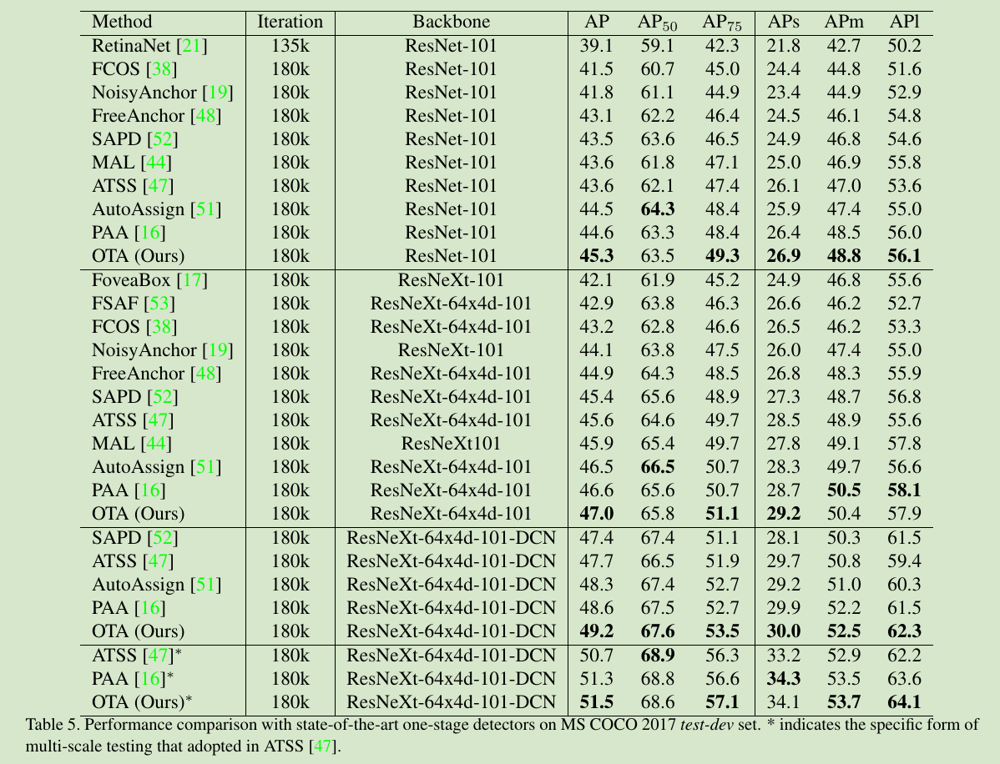

## pipeline
 

## Optimal Transport
最佳运输（OT）描述了以下问题：假设在某个领域中存在m个suppliers（供应者）和n个demanders（需求者,
第i个供应商持有si个单位商品，第j个需求者需要dj个单位商品。 供应商i到需求者j之间每单位商品运输成本用cij表示。
而OT的目的是找到一个最佳的传输计划 π\* = {πi,j | i=1,2,...m,j=1,2,...n}，据此，可以以最小的运输成本将来自供应商的所有商品运输到需求者。
这是一个线性程序，可以在多项式时间内求解。 但是这样所得的线性程序很大，涉及特征维度的平方与所有尺度的anchor。
因此，作者通过一个名为Sinkhorn-Knopp的快速迭代解决方案来解决此问题。

 

## OT for Label Assignment
将标签分配看作是suppliers(label)和demanders(anchor)问题
在目标检测的背景下，假设一张输入图片中有m个gt targets和n个anchors（所有FPN层的），
将每个gt视作有k个单元的正标签（positive label）的suppliers(i.e., si = k, i = 1, 2, ..., m), 每个anchor视作需要一个单元标签的demander(i.e.,dj = 1, j = 1, 2, ..., n), 
将一个单元的标签从gti传到anchorj的代价cfg定义为它们cls和reg losses的加权相加;
 

除了正标签，训练时大量的anchors还会被分配为负标签，成为负样本。
由于最佳传输涉及所有的anchors，所以引入另一个supplier——background，它只提供负标签，
并且提供的总数为n - m×k，从而使得总的supply等于总的demand。将一个单元的负标签从background传输到anchor aj的代价为:
 
 
将这个cost拼接到cost矩阵中，得到π\*∈(m+1)xn

通过Sinkhorn-Knopp迭代这个π\*

**整体流程** 
 

## Advanced Designs
 - Center Prior: 
Center Prior 有利于OTA的训练。 强迫检测器将注意力集中在潜在的积极领域（即中心区域）可以帮助稳定训练过程，尤其是在训练的早期阶段，这将导致更好的最终表现;
因此作者在cost矩阵上加了一个center prior，对于每个gt，根据anchors与gt之间的中心距离从每个FPN级别中选择r2个最接近的anchors，
对于不在r2中的anchor，他们的代价矩阵c中的对应匹配entries将收到附加的常量cost，以减少训练阶段将他们选为正样本的可能性；

 - Dynamic k Estimation: 
每个gt适合的anchor应该根据不同，并基于很多因素，例如目标大小，比例，遮挡条件等；
因此作者提出了一种简单但有效的方法，即根据预测的边界框和gt之间的IoU值，粗略的估计每个gt的正样本的适当数量；
具体来说，对于每个gt，我们根据IoU值选择top q预测。这些IoU值相加，以代表此gt的估计正锚数;

## 实验
 
 
 

