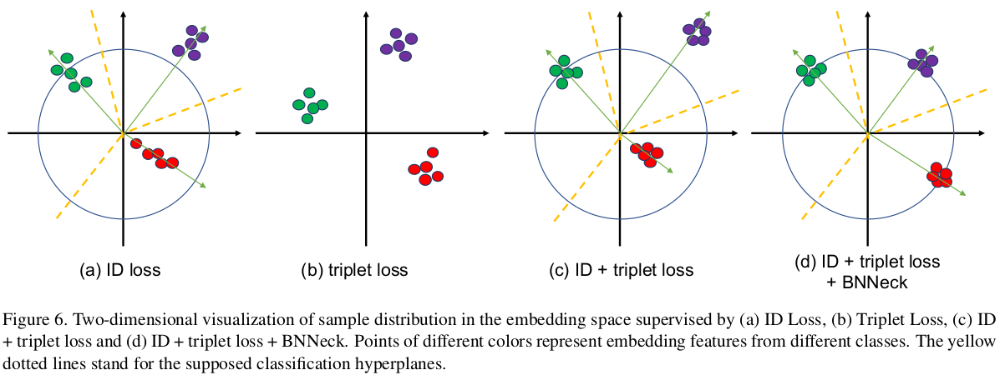

* [贡献](#贡献)
* [Standard Baseline](#standard-baseline)
* [Training Tricks](#training-tricks)
* [实验](#实验)

- **paper**: [https://arxiv.org/pdf/1903.07071v3.pdf](https://arxiv.org/pdf/1903.07071v3.pdf)
- **code**: [https://github.com/michuanhaohao/reid-strong-baseline](https://github.com/michuanhaohao/reid-strong-baseline)

## 贡献
1. 验证一些论文提出的`tricks`
2. 提出了`BNNeck`模块
3. 验证了`batch-size`与`image size`对ReID模型的影响(详细见论文实验部分), 较大的batch-size效果更好，而image size则在实验中的设置表现上都差不多

## Standard Baseline
- ResNet-50
- B(batch-size) = P(number of identities) x K(number of sample/id), baseline中`P=16`, `K=4`
- input size=`256x128`
- 每张图片随机水平翻转，`p=0.5`
- image归一化到[0,1], 再标准化
- triplet loss的margin设置为`0.3`
- 学习率初始化为`0.0035`, 然后在40th和70th时除以10，总共训练120epochs

## Training Tricks
- Warmup Learning Rate

  * 其中t为轮次

- Random Erasing Augmentation
  * 随机擦除数据增强

- Label Smoothing
  * 原始cross entropy loss(下面所说的`ID loss`就是多分类损失)

  * **由于度量学习在测试验证的时候需要分辨没有在训练集中出现的sample，所以防止度量模型的过拟合也是很重要的**
  * 所以引入`label Smoothing`

- Last Stride=1
  * 将ResNet50中最后一次下采样(last stride=2)的步长设置为1
  * 送入`256x128`的图片到网络，会输出`8x4`的特征图
  * 设置last stride=1得到`16x8`的特征图，增加少量的计算量，但是有较明显的精度提升

- BNNeck
  * **ID loss(回归损失)** 构造多个超平面，将嵌入空间分隔为不同的子空间, 每个类别的特征将分布到不同的子空间; **推理时余弦距离比欧几里得距离更适合作为度量标准**；
  * Triplet loss增强了欧氏空间中类内紧性和类间可分性, **但由于Triplet loss 不能提供全局最优约束，类间距离有时小于类内距离**
  * 所以通常的做法是将`triplet loss`和`ID loss`结合在一起使用，**但是由于两种loss的优化空间又是不一致的，所以训练的时候优化是次优的**；
  * 如下图所示：

  * 为了处理该问题，论文提出BNNeck，在特征后面添加一层BN层(classifier FC layers前面), 这样在**该BN层前后的两部分特征ft和fi就用来优化`triplet loss`和`ID loss`**
  * 如下图所示：

  * 由于超球体几乎与坐标轴原点对称，BNNeck的另一个技巧是消除分类器FC层的`bias`。

- Center Loss
  * 由于`triplet loss`考虑的是positive pair和negative pais的距离差值，而不关心positive pair和negative pair的值本身，例如dp=0.3, dn=0.5与dp=1.3, dn=1.5的差值是一样的；
  * `triplet loss`每次只比较随机两个人的IDs，要想优化整个训练集的dp < dn 还是比较困难
  * 所以添加`center loss`来考虑每个样本之间的距离

  * 最终的loss为：

    + 其中`β=0.0005`

## 实验

