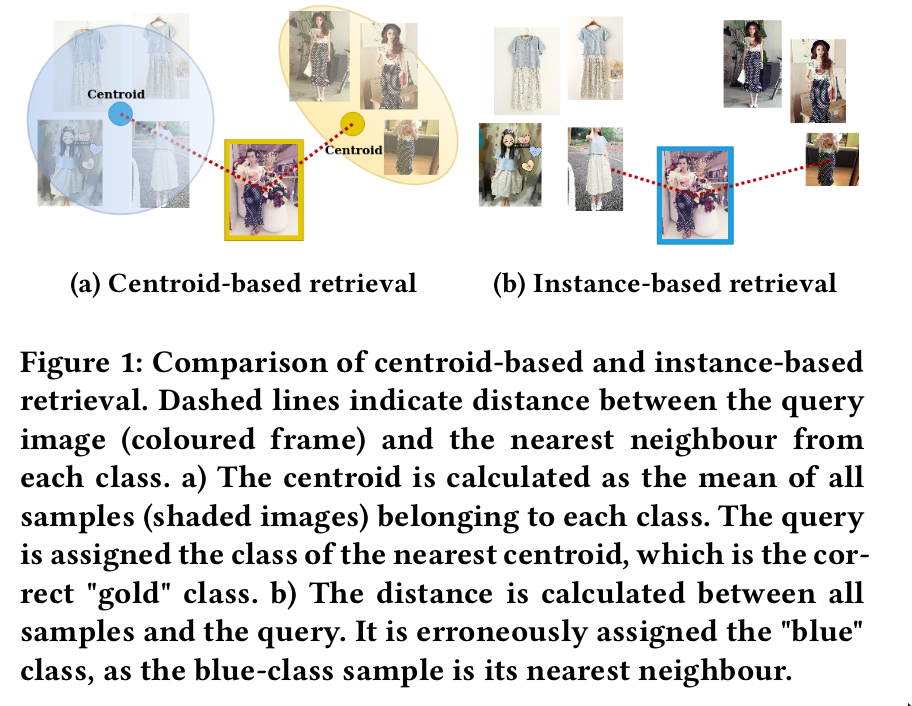

* [贡献](#贡献)
* [提出的方法](#提出的方法)
  - [背景](#背景)
  - [Centroid Triplet Loss](#centroid-triplet-loss)
  - [Aggregating item representations](#aggregating-item-representations)
* [架构](#架构)

- **paper**: [https://arxiv.org/pdf/2104.13643v1.pdf](https://arxiv.org/pdf/2104.13643v1.pdf)
- **code**: [https://github.com/mikwieczorek/centroids-reid](https://github.com/mikwieczorek/centroids-reid)

## 贡献
1. 引入了`Centroid Triplet loss`
2. 在度量的时候引入`class centroids`
3. 在多个数据集(fashion retrieval和person re-identification)上获得了SOTA的结果

## 提出的方法
### 背景

- 在进行度量的时候，查询时通常都是基于`instance`的，查询的数据库中通常有对应类别的多张图片(包括不同视图或者是不同光线等的图片)；
- 这样的方式能够提升一定的召回率，但通常提高召回率的操作都会降低准确率；
- 随着数据库样本的增加，**可能会存在不同类别的不同实例的某些细节信息可能更像当前识别的类别图片**；
- **所以作者提出融合每个`instance`的特征成为一个`class centroid`来提高模型的鲁棒性**；
- 当然也有一些方法提出使用`centroid`来训练triplet loss，但是这也仅仅在训练的时候采用，推理查询的时候还是基于`instance`的；

### Centroid Triplet Loss
- 原始`Triplet loss`

- `Centroid Triplet Loss`

- 其中cp和cN分别为positive的`centroid`和negative的`centroid`

### Aggregating item representations
- 由于训练时候的min-batch每个类别包含M个samples，总共包含P个类别，总共的batch-size为`PxM`
- 其中`class centroid`ckp(也就是上述的cp和cN)就由min-batch中同一类别的sample(除去当前的qk)计算的
- 计算公式如下
  * 训练时：

  * 其中Sk = {x11,...xM}表示某个类别samples的特征向量, qk表示当前计算的sample；
  * 评估时：

  * 其中Gk是数据库当中类别k的所有sample集

## 架构

