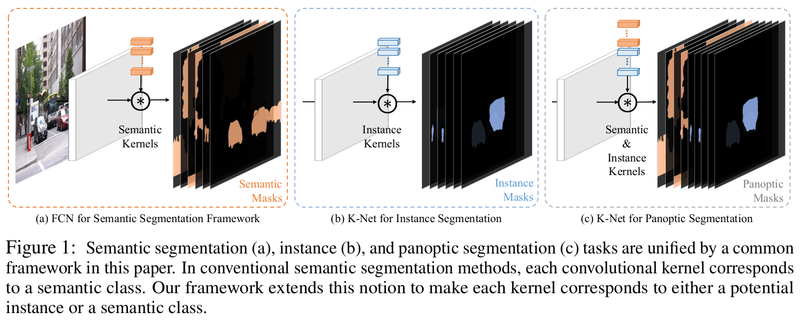
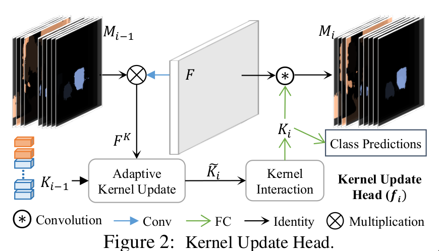
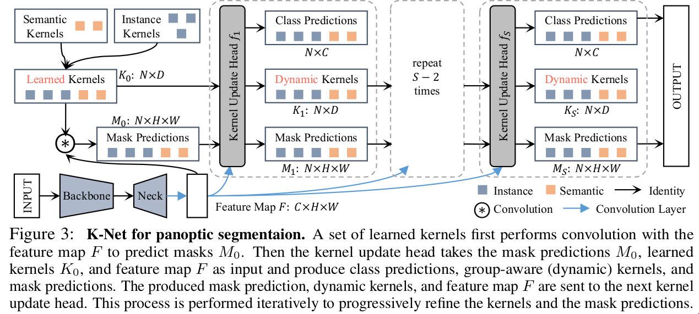

- **paper**: [https://arxiv.org/pdf/2106.14855v2.pdf](https://arxiv.org/pdf/2106.14855v2.pdf)
- **code**: [https://github.com/zwwwayne/k-net](https://github.com/zwwwayne/k-net)

- K-Net提出了一个通用的分割框架，可以处理语义分割，实例分割，全景分割；
- 并得到了`COCO Panoptic Segmentation`上的SOTA；

## 实例分割的N种姿势

自 Mask R-CNN 被提出以来，“先检测后分割”的思路统治了实例分割任务很长一段时间，直到最近两年才涌现出一些单阶段实例分割的探索。近些年来，实例分割方法的思路总结如下:

- Top-down 方法：例如 Mask R-CNN，Cascade Mask R-CNN，以及 HTC 等，都是采用的先检测，后分割的思路，通过框来区分不同物体并获得不同物体的特征图，再进行实例分割。这类算法都会依赖检测框和 NMS
- Bottom-up 方法：例如 Associate Embedding 和 Instance Cut 采用的是先语义分割，然后通过一些 grouping 的过程来区分不同实例。这类算法依赖聚类的操作（grouping process）
- Dense Mask Prediction：从2019年TensorMask开始，有一些方法尝试不依赖检测框，直接从每个feature grid 来预测 instance mask，比如 TensorMask 使用 sliding window，SOLO 把图像拆成不重叠的 grids。因为他们都是遍历 CNN 的 feature grids 来生成密集的 instance mask，所以都需要 NMS 来消除重复的 mask
- Dense Kernel Prediction：还有一些新的探索通过预测 kernel 来生成 mask，但是 kernel 的生成来自于 dense feature grids，是一个位置一个 kernel，因此需要检测框或者NMS来消除重复的实例（例如 SOLO v2 和 CondInst）

## 让实例分割像语义分割那样简单
- 语义分割的思路就是由一组 kernel 来负责语义 mask 的生成，同时由于语义分割任务的特点，可以**让kernel数量和语义类的数量保持一致，并让每一个 kernel 负责一个固定语义类别 mask 的生成**;
- 看起来，也可以引入一组卷积核来负责 mask 的生成，只要限定一个 kernel 只分割一个物体，同时让每个kernel负责分割不同的物体;
- 就像`DETR`(一定数量的query)与`Sparse R-CNN`(一定稀疏数量的proposals)的工作一样，指定一定稀疏数量的kernel就可以了
- 该论文就像`Sparse R-CNN`的思路一样，直接学出一组kernel然后再不断的refine来得到精细的分割结果;

## 实施
- 直接将以上稀疏的思想纳入实例分割结果十分不好
  * instance kernel 其实不像semantic kernel 那样可以具备一些显式的特性来便利学习。例如，由于每一个单独的semantic kernel 都可以和一个唯一的语义类别（ semantic class ）绑定，因此在学习的时候它在每张图上都可以学习着去分割同一个语义类别，而instance kernel不具备这样的特性，所以通过Bipartite matching 来做target assignment，就导致了每个kernel 在每张图上学习的目标是根据他们当前的预测情况动态分配的。
  * 特点1就导致了，instance kernel 实际上要去区分外观（appearance）和尺度（scale）高度变化的物体，需要具备更强的判别特性（discriminative capability）
- 于是作者提出`Kernel Update Head`来不断精细化融合信息校准分割结果
- 如下图所示：

- `Kernel Update Head`首先获得每个kernel对应pixel group 的feature，然后以某种方式动态地更新当前的kernel。
- 为了让kernel还能够modeling全局的信息，增加了一个`kernel interaction`模块，最终得到的特征可以用于分类并产生的dynamic kernel 来和特征图卷积得到更加精确的mask prediction
- 整体架构如下所示:

