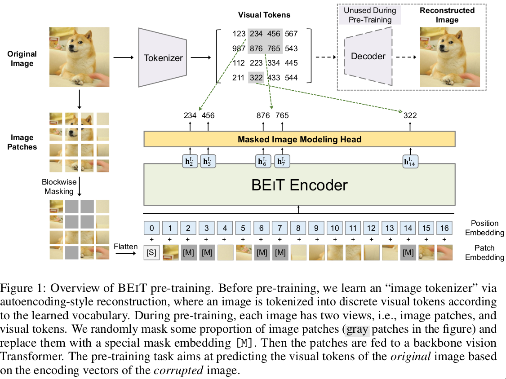

- **paper**: [https://arxiv.org/pdf/2106.08254v1.pdf](https://arxiv.org/pdf/2106.08254v1.pdf) 
- **code**: [https://github.com/microsoft/unilm/tree/master/beit](https://github.com/microsoft/unilm/tree/master/beit) 

 

- 该方法思路与MAE相似(或者应该说MAE与该方法思路相似), 受到NLP中BERT的启发，比较了NLP中masked autoencoding与visual中的不同:
  * Vision transformer的输入image patch，没有NLP中预定义的vocabulary, 因此，我们简单地使用softmax分类器来预测所有可能的masked patches候选
  * 而且语言词汇，如单词和BPE，定义明确，易于自动编码预测。一个简单的替代方法是将任务视为回归问题，该问题**预测masked patches的原始像素(也就是MAE所做的事情)**；
  * 然而，这种像素级恢复任务往往会在训练前的短程相关性和高频细节上浪费建模能力（Ramesh et al.，2021）。
  * 因此该论文的做法是设计了一个Tokenizer来为每一个image patch生成Visual Tokens(类似于NLP的vocabulary)

- 如上图所示，网络预训练流程分两步
  * 首先使用Tokenizer与decoder训练, 从而能够生成Visual Tokens, 然后生成原图的Visual Tokens
  * 然后固定Tokenizer的参数和原图的Visual Tokens, 然后学习复原原图masked patches
  * 有一个细节需要注意是，masked patches是可学习的嵌入

- 相比下来MAE的做法确实更简单有效
