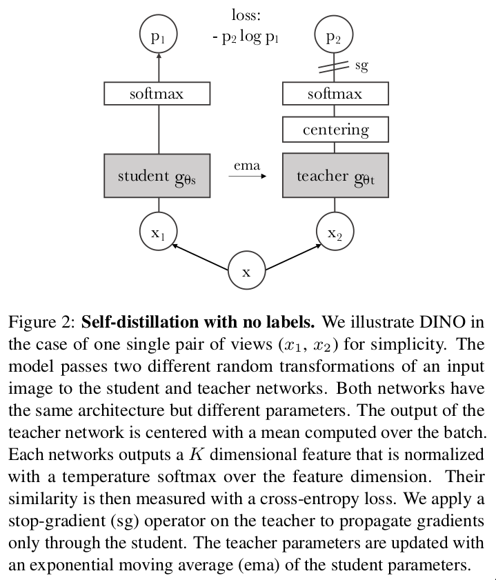
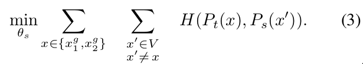
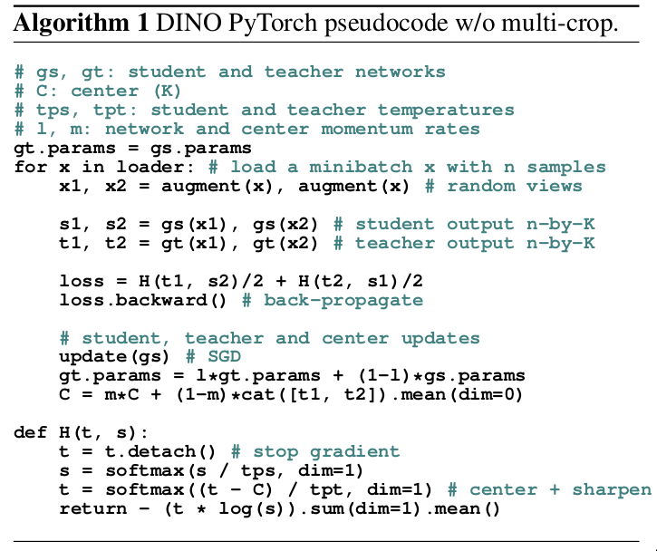
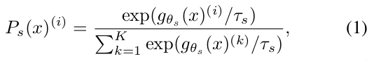
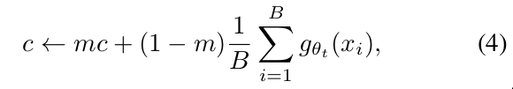

- **paper**: [https://arxiv.org/pdf/2104.14294.pdf](https://arxiv.org/pdf/2104.14294.pdf) 
- **code**: [https://github.com/facebookresearch/dino](https://github.com/facebookresearch/dino) 

## 方法
- 将知识蒸馏运用到self-supervised learning中
- 其中`学生`与`老师`模型架构一样，并且在训练的时候反向传播更新`学生`模型，然后通过EMA更新`老师`模型(在线蒸馏)

- 采用`multi-crop`生成不同的视图作为输入，其中包括两个`全局视图`x1g和x2g和几个`局部视图`;
- 然后最小化蒸馏loss：

  * 其中H(a,b)=-a log b

- 避免崩塌
  * 使用centering和sharpening
- 整体流程伪代码：

## 一些细节
- 模型的输出需要使用softmax归一化(`学生`模型为例)：

- `老师`模型也是如此，不过是τs → τt
- 然后最小化蒸馏loss：

  * 其中H(a,b)=-a log b

- centering可以理解为在`老师`中加了一个bias
  * gt(x) ← gt + c
  * 使用EMA更新center

- sharpening则是在`老师`的softmax归一化的时候使用较低的τt值
- 对于`multi-crop`
  * `全局视图`是裁剪2242 的分辨率，并且包含大部分原图信息(超过50%)
  * `局部视图`是裁剪962 的分辨率，并且包含小部分原图信息(低于50%)
