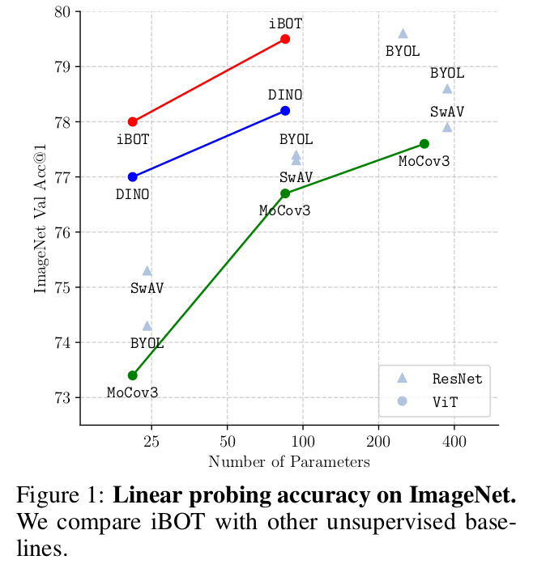
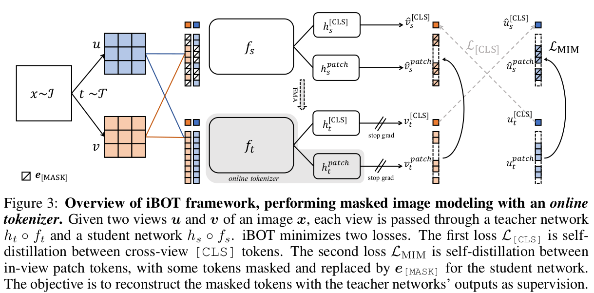
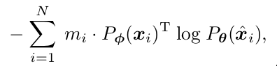
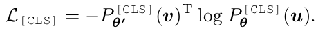
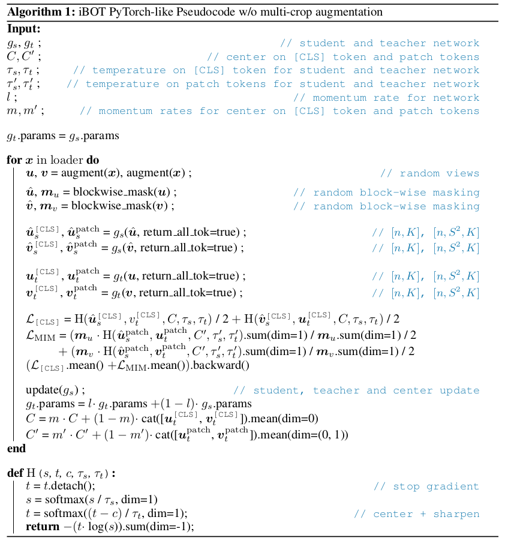

- **paper**: [https://arxiv.org/pdf/2111.07832.pdf](https://arxiv.org/pdf/2111.07832.pdf)
- **code**: not yet

## 方法
- 有点像[BEiT](./BEiT.md)的`Tokenizer`与`MIM(Masked image modeling)`思想与[DINO](./DINO.md)的`在线蒸馏思想`的结合
  * 有BEIT的`Tokenizer`与`patch`编码建模图像信息、DINO的`CLS`建模图片高级语义信息
- 整体架构如下所示

- 具体流程
  * u,v是训练集中相同类别的两张图片
  * 然后image patch化之后分别送入`study`与`teacher`模型backbone(也就是fs与ft)
  * 然后得到的特征分别送入hpatch与h[CLS]映射头
  * 得到结果后如图所示，CLS交叉计算损失, patch各自计算损失
- `study`与`teacher`的Tokenizer架构相同
- `study`模型的输入是随机masked的

## 一些细节
- `patch`公式：

  * 其中m表示是否mask, m ∈ {0, 1}N
  * 按照上面架构图代入变量即可
- `CLS`公式：

- 使用了`multi-crop`
  * local scale: (0.05, 0.32) 
  * global scale: (0.32, 1.0) 
- hpatch与h[CLS]映射头是共享参数的
  * 论文中描述说是为了借助`CLS`的高级语义信息
- 流程伪代码

