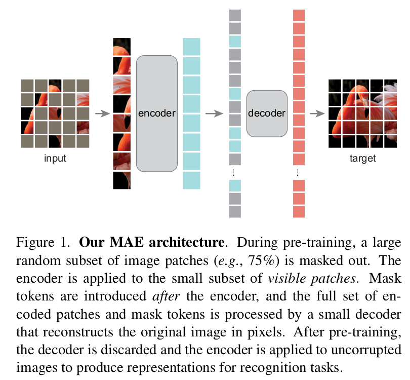
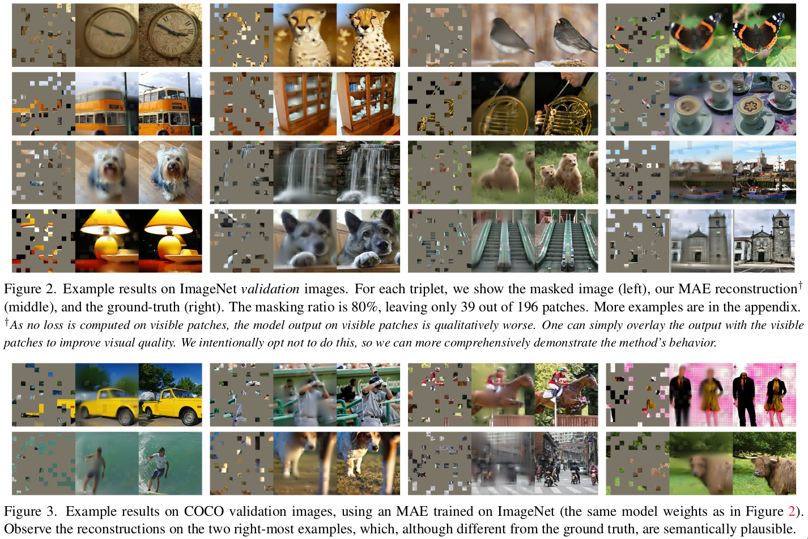
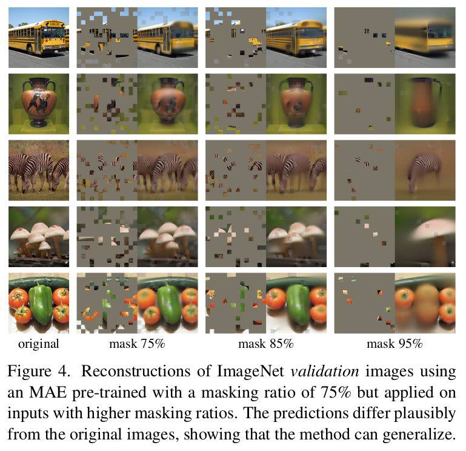

* [Metric](#metric)
* [Architecture](#architecture)
* [Contribution](#contribution)
* [Motivation](#motivation)
* [Method](#method)
* [Details](#details)
* [Some Reconstruction examples](#some-reconstruction-examples)

- **paper**: [https://arxiv.org/pdf/2111.06377v1.pdf](https://arxiv.org/pdf/2111.06377v1.pdf) 
- **code**: [https://github.com/pengzhiliang/MAE-pytorch](https://github.com/pengzhiliang/MAE-pytorch) 

## Metric
- Linear Probe
  * 直接使用预训练的backbone来预测结果，不进行微调，即自监督训练的所有权重冻结，只训练分类或者其他下游任务的业务层网络。
  * 基于的原理是如果模型能够比较好的提取特征，那么如果在这个特征上直接进行分类，那么分类任务应该也会取得非常好的效果。
  * 因为在线性探测中，下一个阶段的分类任务只知道上一个阶段模型产生的特征，而上一个阶段的模型结果对他来说是一个黑盒子，因此它能不受模型架构的影响而更精确的衡量特征的质量

- Fine-tuning
  * 使用带标签的数据对包含分类层和特征提取部分的整个网络在无监督训练的基础上进行参数值的微调

## Architecture

## Contribution
1. 提出简单有效的MAE架构，仅在ImageNet-1k上自监督预训练，即可达到87.8%的精度，实现了新SOTA；
2. 不需要像对比学习思路的自监督，依赖数据增强的设计策略, 整个流程简单有效；
3. 泛化性高，对于目标检测、语义分割等下游任务也有精度提升；
4. 由于masking ratio比较高以及decoder设计轻量，因此训练速度较其他方法更快；

## Motivation
NLP通过自监督预训练成功地解决了对数据的偏好(过拟合)。基于GPT中的自回归语言建模和BERT中的masked autoencodeing的解决方案在概念上很简单：它们删除部分数据并学习预测删除的内容。这些方法现在可以训练包含超过1000亿个参数的可推广NLP模型。

鉴于NLP中masked autoencodeing的成功，作者从以下3各方面思考masked autoencodeing在vision和language的不同：
1. **架构不同**，视觉中更多的是采用CNN处理，卷积通常在规则网格上运行，并且将诸如mask tokens或位置嵌入等“指示符”集成到卷积网络中并不容易。然而ViT的引入，这一差距不再是障碍。
2. **language与vision的信息密度不同**，
  a. 语言是人发明的，具有高语义与信息稠密性；当训练一个模型来预测每个句子中只有几个遗漏的单词时，这项任务似乎可以诱导复杂的语言理解；
  b. 而图像则是具有重度空间冗余的自然信号；遗失块可以通过不具有高级语义理解的邻近块重建;
  c. **为了解决该差距并鼓励模型学习有用的特征，论文提出了一种简单的策略：高比例随机块掩码**

3. **自编码器的解码器不同**, 在视觉上，解码器进行像素重建，因此输出相比于回归任务具有更低的语义信息；而在NLP中解码器预测遗失的词，包含丰富的语义信息；因此图像的解码器设计比语言的解码器更重要；

## Method
基于以上原因，作者提出一个简单有效的MAE架构。
- MAE随机mask输入图片块，然后在像素空间复原丢失(mask)的图像块。
- MAE具有一个不对称的结构，解码器只处理未被mask的输入图像块，解码器是轻量级的，并通过mask token和解码器输出的隐式表示来还原原图。
- 因为设计中的masking ratio很高(75%)，并且解码器设计很轻量，因此训练速度很快，并且减少了内存占用。
- 整体流程如上图所示

## Details
- masking ratio在75%效果最好，mask采样策略为满足uniform分布的随机不重复采样, 消融实验展示了其他采样方式(block、grid)，都没有random效果好
- encoder的输入只包括unmasked patches，这样计算量更低，并且消融实验证明这样的策略对精度也有帮助
- 对于decoder的输入，包含encoded的隐式表达，然后将mask tokens按照之前的随机采样策略，进行unshffle(inverting the random shuffle), 两者合并为输入(当然mask包含位置编码)
- 有一个细节需要注意是，masked tokens是可学习的嵌入
- 数据增强仅采用简单的copping+rand size
- 对训练恢复原图时的target进行归一化，归一化有一定精度提升
- 损失函数采用简单的MSE loss
- 训练速度快，在使用相同设备的情况下，MAE训练1600epochs31小时，而MoCov3训练300epochs需要36小时
- MAE预训练之后对backbone的一个transformer block进行finetuning，即可提高7.5%的精度
- MAE对目标检测，实例分割，语义分割等下游任务都有明显精度提升。

## Some Reconstruction examples

