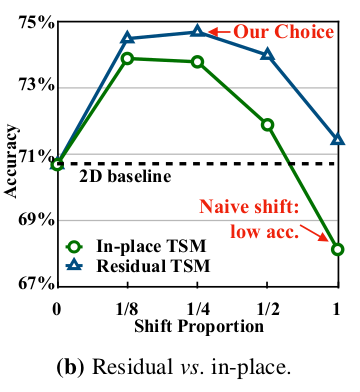

* [贡献](#贡献)
* [Temporal Shift Module(TSM)](#temporal-shift-moduletsm)
  - [Naive Shift Does Not Work](#naive-shift-does-not-work)
  - [Module Design](#module-design)
    + [减少数据移动](#减少数据移动)
    + [保证空间特征的建模](#保证空间特征的建模)
  - [TSM Video Network](#tsm-video-network)

- **paper**: [https://arxiv.org/pdf/2109.13227v1.pdf](https://arxiv.org/pdf/2109.13227v1.pdf) 
- **code**: [https://github.com/MIT-HAN-LAB/temporal-shift-module](https://github.com/MIT-HAN-LAB/temporal-shift-module)

## 贡献
- 视频处理通常使用3D卷积处理数据，由于新增了一个时间维度，计算量也大大增加，并且由于3D的良好建模能力，可能会存在过拟合的问题；
- 论文中使用2D卷积 + temporal-shift, 不需要计算，但具有很强的时空建模能力
- 论文中发现直接进行`shift`既不能实现高效也不能实现高精度
  * 于是提出了两个模块`partial shift`和`residual shift`来获得高效的模型设计
- 针对offline video提出`bi-directional TSM`
- 针对online video提出`uni-directional TSM`

## Temporal Shift Module(TSM)
- 如下图所示

### Naive Shift Does Not Work
- 也就是对所有通道shift
1. 由于大量的数据移动，效率是很低的
2. 由于大量的shift，导致当前帧不发访问通道信息，损害backbone的建模能力

### Module Design
#### 减少数据移动
- 只shift ( 1/8, 1/4, 1/2 )的通道，而不是全部的
- shift全部的会在CPU上带来13.7%额外的推理时间
- shift 1/8 只会带来3%的额外推理时间
- 实验结果如下图所示

#### 保证空间特征的建模
- 直接采用`in-place shift`会损害backbone的空间特征学习能力, 特别是shift的通道数量比较多的时候，当前帧的的信息会损失；
- 于是论文采用`Residual shift`在残差分支中进行shift, 这样既保证了当前帧的信息也获得了时序相邻帧的信息
- 两者结构如下所示：

- 实验结果如下所示：

- **最终选择的是shift 1/4(每个方向1/8)的通道数**

### TSM Video Network
- online video network

- 值得注意的是由于online network是单向的(因为没有未来帧的信息), 所以shift 1/8的通道数
- 每一帧都会缓存当前帧的1/8的特征通道，融合到下一帧的7/8中
